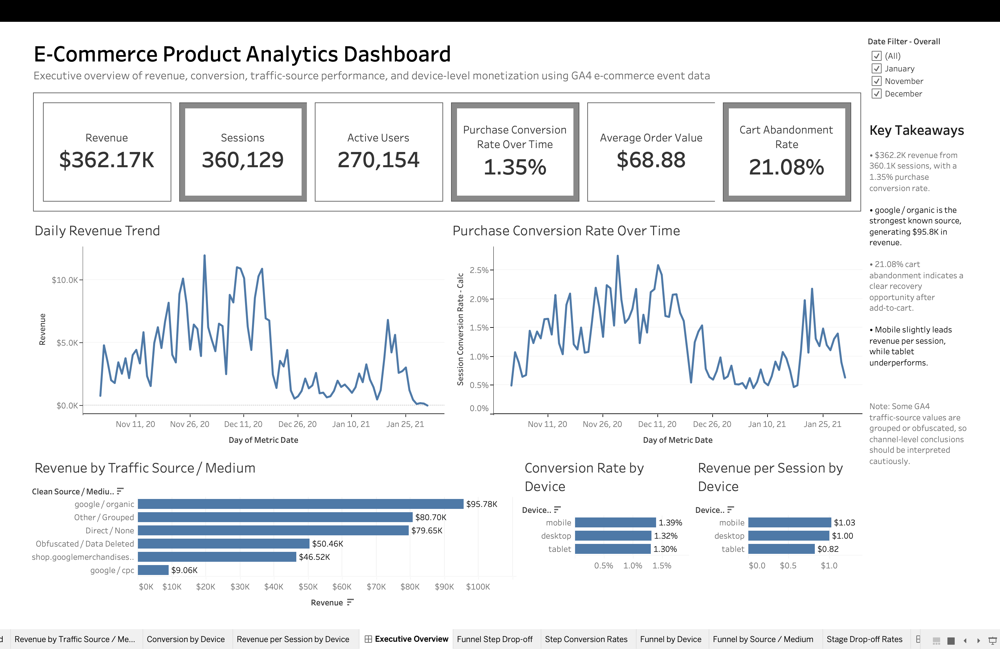
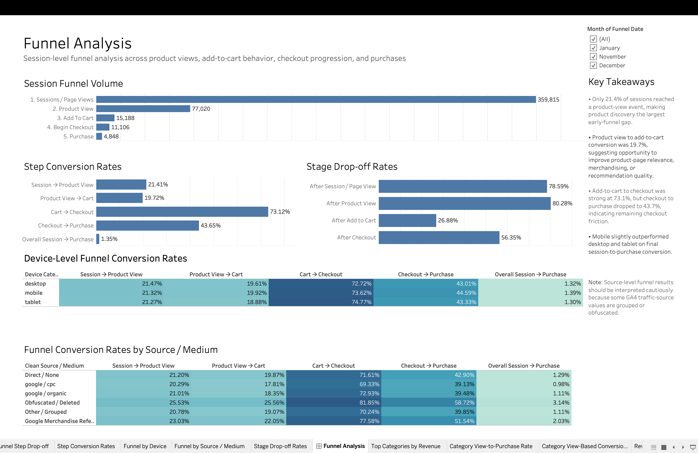
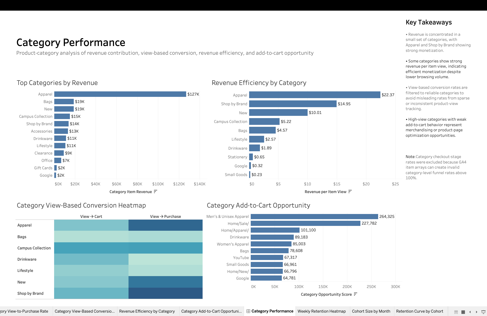
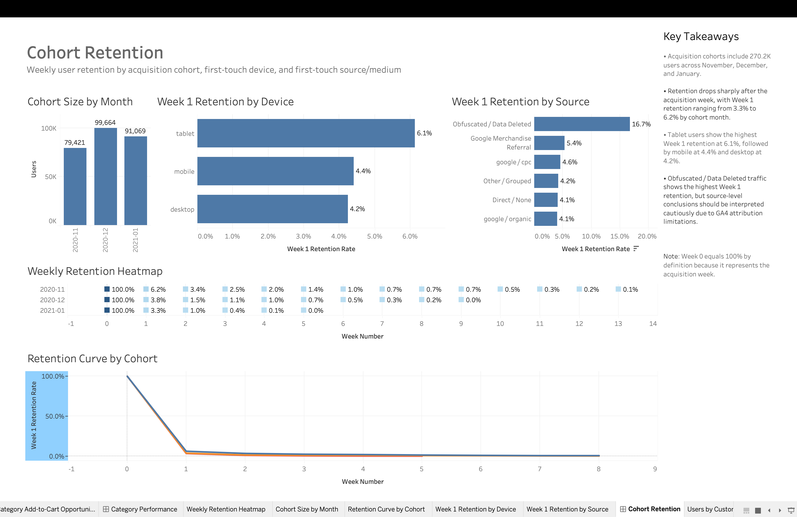
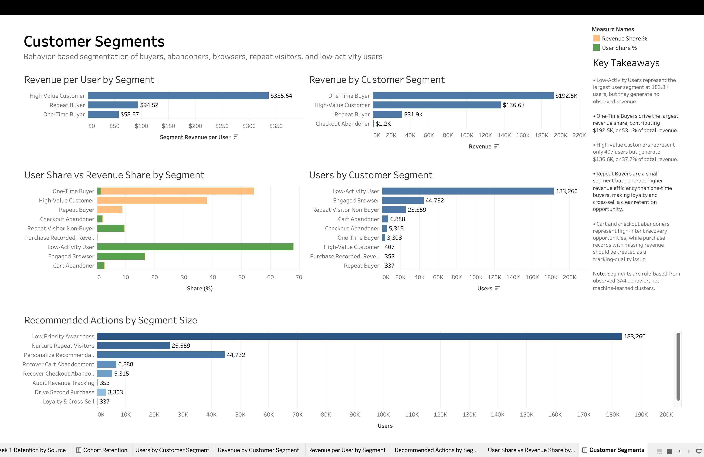
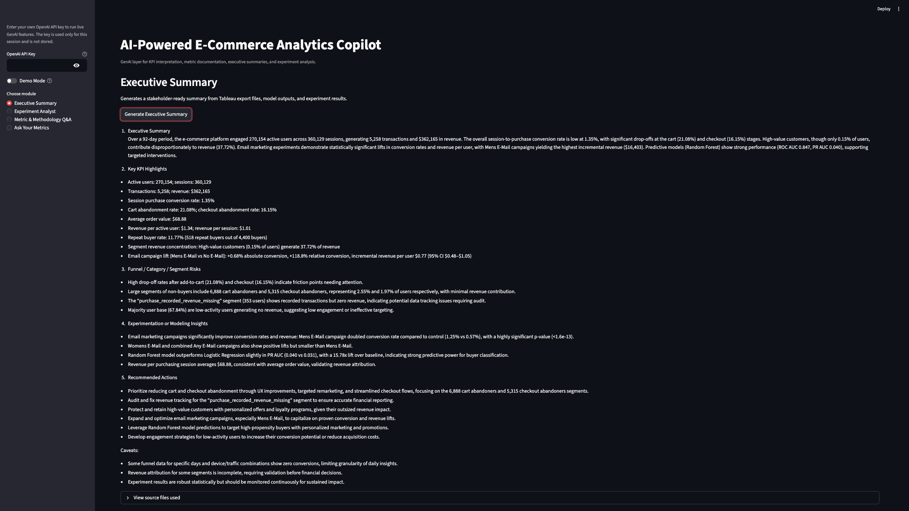
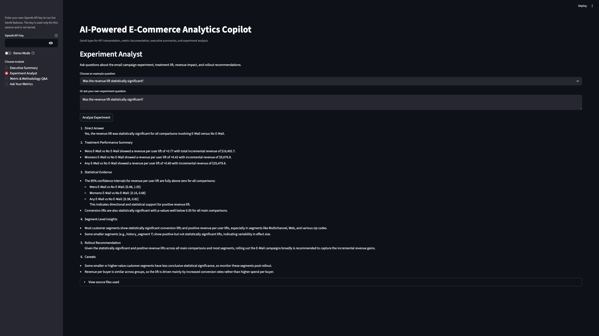
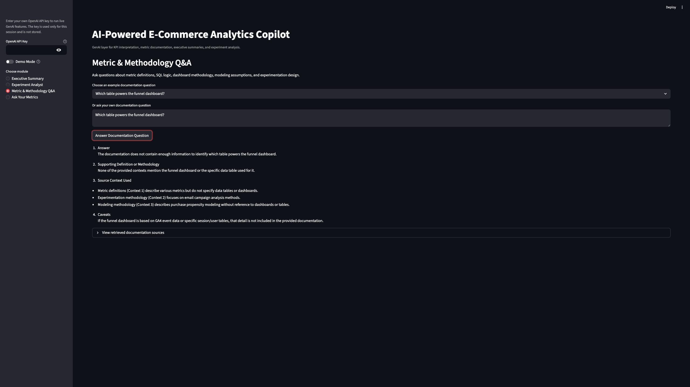
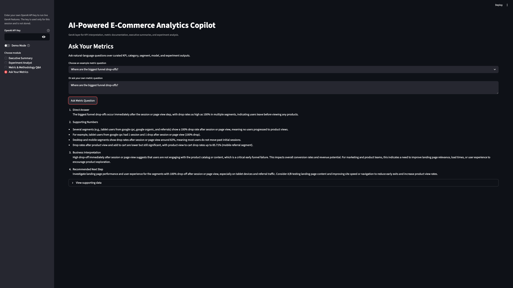

# E-Commerce Product Analytics, Experimentation & AI Copilot Platform

[View Tableau Dashboard](https://public.tableau.com/views/GA-E-commerce/CustomerSegments?:language=en-US&:sid=&:redirect=auth&:display_count=n&:origin=viz_share_link)

<!-- [View AI Analytics Copilot](YOUR_STREAMLIT_APP_LINK_HERE) -->

## Overview

This project simulates the work of a product data scientist at an e-commerce company.

The goal is to analyze event-level customer behavior, diagnose conversion funnel drop-offs, identify product and customer opportunities, model future purchase propensity, and evaluate randomized marketing experiments.

The project combines:

- BigQuery SQL analytics engineering
- GA4 event-level data analysis
- Tableau executive dashboards
- Customer segmentation
- Purchase propensity modeling
- A/B testing and campaign experimentation
- AI-powered analytics copilot for natural-language KPI Q&A, metric documentation, executive summaries, and experiment interpretation
- Business recommendations for product and marketing teams

The core dataset is the Google Analytics 4 BigQuery E-Commerce Demo Dataset. For the experimentation module, the project uses the MineThatData Email Campaign dataset to evaluate conversion lift, revenue lift, confidence intervals, and segment-level treatment effects.

---

## Business Problem

Leadership wants to improve e-commerce conversion, customer retention, and revenue.

This project answers the following product and business questions:

- Where do users drop off in the purchase funnel?
- Which traffic sources and devices drive stronger conversion and revenue?
- Which product categories generate revenue or create missed add-to-cart opportunities?
- Which customer cohorts retain after acquisition?
- Which customer segments should marketing prioritize?
- Which users are most likely to purchase in the future?
- Did the email campaign create incremental conversion and revenue lift?
- What product, merchandising, and marketing actions should leadership prioritize?

---

## Key Results

### Product Analytics

| Metric | Value |
|---|---:|
| Revenue | $362.17K |
| Sessions | 360,129 |
| Active Users | 270,154 |
| Purchase Conversion Rate | 1.35% |
| Average Order Value | $68.88 |
| Cart Abandonment Rate | 21.08% |

### Funnel Insights

- Only 21.4% of sessions reached a product-view event, making product discovery the largest early-funnel gap.
- Product view to add-to-cart conversion was 19.7%.
- Add-to-cart to checkout conversion was strong at 73.1%.
- Checkout to purchase conversion dropped to 43.7%, indicating remaining checkout friction.
- Mobile slightly outperformed desktop and tablet in session-to-purchase conversion.

### Category Insights

- Revenue was concentrated in a small set of categories.
- Apparel generated approximately $127K in revenue.
- Apparel and Shop by Brand showed strong monetization efficiency.
- High-view categories with weak add-to-cart behavior created merchandising and product-page optimization opportunities.

### Customer Segmentation

- Low-activity users were the largest segment, with 183.3K users and no observed revenue.
- One-time buyers drove the largest revenue share, contributing approximately $192.5K, or 53.1% of revenue.
- High-value customers represented only 407 users but generated approximately $136.6K, or 37.7% of revenue.
- Repeat buyers were small in count but had higher revenue efficiency than one-time buyers.
- Cart and checkout abandoners represent high-intent recovery opportunities.

### Purchase Propensity Modeling

| Model | ROC-AUC | PR-AUC | PR-AUC Lift vs Baseline |
|---|---:|---:|---:|
| Logistic Regression | 0.846 | 0.031 | 12.4x |
| Random Forest | 0.847 | 0.040 | 15.8x |

Additional lift results:

| Audience | Purchase Rate | Lift vs Baseline |
|---|---:|---:|
| Top 1% scored users | 6.27% | 24.7x |
| Top 2% scored users | 4.50% | 17.7x |
| Top 5% scored users | 2.50% | 9.9x |
| Top 10% scored users | 1.76% | 6.9x |

The model is best interpreted as a purchase-propensity ranking system rather than a strict binary classifier.

### Experimentation Results

| Comparison | Conversion Lift | Relative Lift | Revenue/User Lift | Revenue Lift 95% CI |
|---|---:|---:|---:|---:|
| Mens E-Mail vs Control | +0.68 pp | +118.8% | +$0.77 | $0.48 to $1.05 |
| Womens E-Mail vs Control | +0.31 pp | +54.3% | +$0.42 | $0.16 to $0.68 |
| Any E-Mail vs Control | +0.50 pp | +86.5% | +$0.60 | $0.38 to $0.82 |

The email campaign produced statistically significant conversion and revenue lift. Mens E-Mail was the strongest overall campaign variant.

---

## Dashboard Screenshots

### Executive Overview



### Funnel Analysis



### Category Performance



### Cohort Retention



### Customer Segments



---
---

### AI Copilot Screenshots

#### Executive Summary Generator


#### Experiment Analyst


#### Metric & Methodology Q&A


#### Ask Your Metrics



## Project Architecture

```mermaid
flowchart LR
    A[GA4 BigQuery E-Commerce Demo Dataset] --> B[BigQuery SQL Analytics Layer]
    B --> C[Staging Tables]
    C --> D[Intermediate Session and User Tables]
    D --> E[Analytics Mart Tables]

    E --> F[Tableau Export Tables]
    E --> G[Python Analysis Notebooks]
    E --> H[ML Feature Export]

    F --> I[Tableau Dashboards]
    G --> J[Data Quality EDA]
    H --> K[Purchase Propensity Modeling]
    G --> L[Customer Segmentation Analysis]

    M[MineThatData Email Campaign Dataset] --> N[Experimentation Notebook]
    N --> O[Experiment Lift Outputs]

    K --> P[Model Metrics, Lift Tables, Scored Users]
    I --> Q[Dashboard Screenshots]
    F --> R[CSV Analytics Outputs]
    O --> R
    P --> R

    R --> S[AI-Powered Analytics Copilot]
    T[Knowledge Base: Metric Definitions, SQL Logic, Methodology Notes] --> S
    U[OpenAI API] --> S
    V[SentenceTransformers + FAISS] --> S

    S --> W[Natural-Language KPI Q&A]
    S --> X[Metric & Methodology RAG]
    S --> Y[Executive Summary Generator]
    S --> Z[Experiment Analyst]

    I --> AA[Business Recommendations]
    K --> AA
    O --> AA
    S --> AA