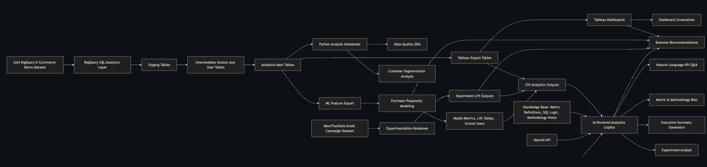

# E-Commerce Product Analytics, Experimentation & AI Copilot Platform

## End-to-End Product Data Science Case Study

**Author:** Pranav Padmannavar  
**Project Duration:** April 2026 – May 2026  
**Focus Areas:** Product Analytics, Experimentation, Purchase Propensity Modeling, Analytics Engineering, GenAI Analytics Copilot  
**Tools:** BigQuery SQL, Python, Tableau, Scikit-learn, Streamlit, OpenAI API, FAISS, SentenceTransformers  

**Project Links**

- [GitHub Repository](https://github.com/pranavsp108/ecommerce-product-analytics-experimentation.git)
- [Tableau Dashboard](https://public.tableau.com/views/GA-E-commerce/CustomerSegments?:language=en-US&:sid=&:redirect=auth&:display_count=n&:origin=viz_share_link)
- [AI Analytics Copilot](https://ecommerce-analytics-copilot.streamlit.app/)

---

## Table of Contents

| Section | Title |
|---:|---|
| 1 | [Executive Summary](#1-executive-summary) |
| 2 | [Business Context](#2-business-context) |
| 3 | [Project Objectives](#3-project-objectives) |
| 4 | [Data Sources](#4-data-sources) |
| 5 | [Solution Architecture](#5-solution-architecture) |
| 6 | [Analytics Engineering Pipeline](#6-analytics-engineering-pipeline) |
| 7 | [Data Quality and Feature Engineering](#7-data-quality-and-feature-engineering) |
| 8 | [Product Analytics Dashboard Layer](#8-product-analytics-dashboard-layer) |
| 9 | [Funnel Analysis](#9-funnel-analysis) |
| 10 | [Category Performance Analysis](#10-category-performance-analysis) |
| 11 | [Cohort Retention Analysis](#11-cohort-retention-analysis) |
| 12 | [Customer Segmentation](#12-customer-segmentation) |
| 13 | [Purchase Propensity Modeling](#13-purchase-propensity-modeling) |
| 14 | [Experimentation Analysis](#14-experimentation-analysis) |
| 15 | [AI-Powered Analytics Copilot](#15-ai-powered-analytics-copilot) |
| 16 | [Business Recommendations](#16-business-recommendations) |
| 17 | [Limitations and Future Improvements](#17-limitations-and-future-improvements) |
| 18 | [Skills Demonstrated](#18-skills-demonstrated) |
| 19 | [Appendix](#19-appendix) |

---


<div style="page-break-before: always;"></div>

&nbsp;

## 1. Executive Summary

This project is an end-to-end e-commerce product data science case study that combines product analytics, analytics engineering, predictive modeling, experimentation, and GenAI-based business intelligence.

The project simulates the work of a product data scientist supporting an e-commerce leadership team that wants to improve conversion, customer retention, customer targeting, and marketing effectiveness. The analysis begins with event-level Google Analytics 4 e-commerce data in BigQuery, transforms it into business-ready analytical tables, surfaces insights through Tableau dashboards, builds a purchase propensity model, evaluates randomized email campaign performance, and adds an AI-powered analytics copilot to make the outputs easier for business teams to use.

The platform answers both descriptive and decision-oriented questions:

- How is the e-commerce funnel performing?
- Where do users drop off before purchase?
- Which product categories and customer segments drive revenue?
- Which users are more likely to purchase in the future?
- Did email marketing create incremental conversion and revenue lift?
- How can product, marketing, and leadership teams consume these insights faster through AI?

The project uses two datasets:

1. **Google Analytics 4 BigQuery E-Commerce Demo Dataset**  
   Used for product analytics, funnel analysis, cohort retention, customer segmentation, and purchase propensity modeling.

2. **MineThatData Email Campaign Dataset**  
   Used for randomized treatment-control experimentation, conversion lift analysis, revenue lift estimation, and segment-level treatment effect analysis.

The final system includes four major layers:

1. **Analytics Engineering Layer**  
   BigQuery SQL pipelines transform raw GA4 events into staging, intermediate, mart, Tableau export, and machine learning feature tables.

2. **Business Intelligence Layer**  
   Tableau dashboards present executive KPIs, funnel performance, category trends, cohort retention, and customer segments.

3. **Data Science Layer**  
   Python notebooks build and evaluate a purchase propensity model and analyze randomized email campaign results.

4. **AI Copilot Layer**  
   A Streamlit-based GenAI app uses OpenAI API, FAISS, SentenceTransformers, and curated analytics outputs to answer metric questions, explain methodology, summarize results, and interpret experiments.

---

### 1.1 Summary of Key Business Outcomes

The analysis surfaced several high-impact findings.

| Area | Key Finding | Business Implication |
|---|---|---|
| Revenue Performance | The platform generated approximately **$362.17K** in revenue across **360,129 sessions** and **270,154 active users**. | Establishes the baseline business scale for KPI monitoring and optimization. |
| Conversion | Overall purchase conversion was **1.35%**. | Conversion improvement should be a central product and growth priority. |
| Funnel | Only **21.4% of sessions reached product view**, making product discovery the largest early-funnel gap. | Improve navigation, search, recommendations, landing-page relevance, and merchandising. |
| Category Performance | Revenue was concentrated in a small set of categories, with Apparel contributing approximately **$127K**. | Prioritize high-performing categories while diagnosing high-view, low-conversion categories. |
| Customer Segments | One-time buyers contributed approximately **53.1% of revenue**, while high-value customers contributed **37.7%** despite being a small group. | Focus on second-purchase campaigns, VIP retention, and high-value customer protection. |
| Propensity Modeling | Random Forest achieved **0.847 ROC-AUC** and **15.8x PR-AUC lift** over baseline. | Use model scores to prioritize retargeting and high-intent audience activation. |
| Experimentation | Mens E-Mail produced **+0.68 percentage-point conversion lift** and **+$0.77 revenue/user lift** vs control. | Mens E-Mail should be prioritized for rollout, with continued segment-level testing. |
| AI Copilot | GenAI layer enables natural-language KPI Q&A, metric documentation, executive summaries, and experiment interpretation. | Makes analytics outputs more accessible for non-technical product and marketing stakeholders. |

---

### 1.2 Project Value Proposition

This project is designed to demonstrate more than dashboarding. It shows how a product data scientist can build a decision-support system that connects raw behavioral data to business action.

The project creates value across the full analytics lifecycle:

```text
Raw event data
    → Analytics engineering
    → Business KPI dashboards
    → Behavioral segmentation
    → Predictive modeling
    → Experiment evaluation
    → AI-assisted stakeholder insights
```

This is important because real product data science work rarely ends at model training or dashboard creation. The value comes from building reliable data foundations, interpreting user behavior, quantifying business impact, and translating findings into decisions.

The project demonstrates the following capabilities:

- Building scalable SQL transformations from event-level behavioral data
- Designing product KPIs and funnel metrics
- Creating executive dashboards for stakeholder consumption
- Segmenting customers into action-oriented business groups
- Building leakage-safe predictive models
- Evaluating rare-event classification using PR-AUC and lift
- Running treatment-control experiment analysis
- Interpreting statistical and practical significance
- Building a GenAI analytics assistant over structured outputs and documentation

---

### 1.3 Report Navigation

The report includes dashboard screenshots and AI copilot screenshots in the sections where they are most relevant:

- Executive Overview Dashboard: Section 8
- Funnel Analysis Dashboard: Section 9
- Category Performance Dashboard: Section 10
- Cohort Retention Dashboard: Section 11
- Customer Segments Dashboard: Section 12
- AI Copilot Screenshots: Section 15

This keeps the executive summary focused on the business case while preserving visual evidence in the detailed analysis sections.

---
<div style="page-break-before: always;"></div>

&nbsp;

## 2. Business Context

E-commerce companies operate in an environment where small changes in conversion, retention, targeting, and campaign performance can create large revenue impact. Product, marketing, and analytics teams need to understand how users move through the customer journey, where they disengage, and which interventions are most likely to improve business outcomes.

A typical e-commerce customer journey includes several stages:

```text
Session start
    → Product discovery
    → Product view
    → Add to cart
    → Checkout
    → Purchase
    → Repeat purchase / retention
```

Each stage can create friction. Users may arrive from low-quality traffic sources, fail to discover relevant products, abandon carts, drop during checkout, or purchase once and never return. Without a structured analytics layer, these behaviors remain difficult to diagnose.

This project frames the problem from the perspective of a product data scientist supporting leadership, product managers, marketing teams, analysts, and business stakeholders.

The leadership team wants to answer:

- Are we acquiring high-quality users?
- Are users discovering products effectively?
- Which funnel step creates the largest drop-off?
- Which product categories generate the most revenue?
- Which customer segments deserve retention or remarketing investment?
- Can we predict future buyers before they purchase?
- Do marketing campaigns create measurable incremental lift?
- Can AI help teams consume analytics faster and more consistently?

---

### 2.1 Stakeholder Groups

The project supports several stakeholder groups.

| Stakeholder | Questions They Care About | Project Output |
|---|---|---|
| Executives | Are revenue and conversion improving? Where should we invest? | Executive KPI dashboard, AI executive summaries |
| Product Managers | Where does the user journey break down? Which product areas need improvement? | Funnel dashboard, category dashboard, cohort analysis |
| Marketing Teams | Which segments should we target? Which campaign variant works best? | Customer segmentation, propensity scores, experiment analysis |
| Data Scientists | Can we predict future conversion and evaluate treatments rigorously? | Propensity model, lift analysis, A/B testing notebook |
| Analysts | Are metric definitions consistent and reproducible? | SQL marts, documentation RAG, metric definitions |
| Business Users | Can I ask questions without writing SQL? | AI analytics copilot |

---

### 2.2 Core Business Problem

The central business problem is:

> How can an e-commerce company use behavioral data to improve conversion, retention, targeting, and campaign effectiveness?

This broad problem is broken into four analytical subproblems.

#### Subproblem 1: Conversion Diagnosis

The first challenge is identifying where users drop off in the funnel. A low conversion rate may be caused by poor traffic quality, weak product discovery, product-page friction, cart abandonment, or checkout issues. Each cause requires a different business action.

For example:

- If users do not reach product pages, the issue may be navigation, search, recommendations, or landing-page relevance.
- If users view products but do not add to cart, the issue may be pricing, product content, trust signals, or product-market fit.
- If users add to cart but do not purchase, the issue may be checkout friction, shipping costs, payment issues, or purchase hesitation.

The project addresses this using funnel analysis and daily funnel metrics.

#### Subproblem 2: Customer Value Prioritization

Not all users contribute equally to revenue. Some users browse without intent, some purchase once, some repeat, and a small group may generate a large share of revenue.

The business needs to distinguish between:

- Low-activity users
- Engaged browsers
- Cart abandoners
- Checkout abandoners
- One-time buyers
- Repeat buyers
- High-value customers

The project addresses this through customer segmentation and revenue share analysis.

#### Subproblem 3: Future Buyer Prediction

Marketing and growth teams need a way to prioritize users before they purchase. If every user receives the same retargeting treatment, spend may be wasted on low-intent users.

The project addresses this by building a purchase propensity model using pre-cutoff behavior only. This allows the business to rank users by likelihood of future purchase and prioritize campaigns accordingly.

#### Subproblem 4: Campaign Incrementality

A campaign may appear successful if treated users buy more, but without a control group it is unclear whether the campaign caused the increase. The business needs to measure incremental lift using treatment-control comparison.

The project addresses this through randomized email campaign experimentation using the MineThatData dataset. It evaluates conversion lift, revenue-per-user lift, p-values, bootstrap confidence intervals, and segment-level treatment effects.

---

### 2.3 Why Add an AI Copilot?

Traditional analytics outputs often require stakeholders to open dashboards, inspect tables, read documentation, or ask analysts follow-up questions. This creates friction in decision-making.

The AI Copilot layer addresses this gap by allowing business users to ask natural-language questions such as:

- What are the overall KPIs?
- Which customer segment has the highest revenue per user?
- How was purchase conversion rate calculated?
- How was leakage avoided in the propensity model?
- Should we roll out Mens E-Mail?
- What are the key risks and opportunities this week?

The AI layer does not replace the analytics pipeline. It sits on top of validated outputs and documentation.

The design principle is:

```text
Structured analytics outputs remain the source of truth.
The AI layer explains, summarizes, and retrieves from those outputs.
```

This reduces hallucination risk and makes the copilot more credible as a business assistant.

---
<div style="page-break-before: always;"></div>

&nbsp;

## 3. Project Objectives

The project has five primary objectives.

---

### Objective 1: Build a Reproducible Analytics Engineering Layer

The first objective is to transform raw GA4 event data into reliable analytical tables.

This includes:

- Staging raw events and item-level data
- Constructing session-level and user-level behavior tables
- Creating product KPI marts
- Preparing funnel, cohort, and segmentation outputs
- Exporting clean tables for Tableau and machine learning

The goal is to ensure that downstream dashboards and models are built on consistent definitions.

---

### Objective 2: Diagnose Product and Funnel Performance

The second objective is to analyze how users move through the e-commerce journey.

This includes:

- Measuring total sessions, active users, revenue, and conversion
- Quantifying product-view, add-to-cart, checkout, and purchase progression
- Identifying the largest funnel drop-offs
- Comparing performance by device and traffic source
- Translating funnel findings into product actions

This provides the business with a clear view of where conversion opportunities exist.

---

### Objective 3: Identify Customer and Category Opportunities

The third objective is to identify which customer segments and product categories deserve prioritization.

This includes:

- Category-level revenue and conversion analysis
- Customer segmentation by value, intent, lifecycle, and abandonment behavior
- Revenue share vs user share analysis
- Recommended business actions by segment

This helps marketing and merchandising teams avoid treating all users and categories equally.

---

### Objective 4: Build Predictive and Experimental Decision Support

The fourth objective is to add data science methods that support decision-making beyond descriptive dashboards.

This includes:

- Building a leakage-safe future purchase propensity model
- Evaluating model performance using rare-event classification metrics
- Generating propensity scores and lift tables
- Analyzing randomized email campaign treatment effects
- Estimating conversion and revenue lift
- Interpreting statistical and practical significance

This strengthens the project from a BI case study into a product data science case study.

---

### Objective 5: Add a GenAI Layer for Stakeholder Enablement

The fifth objective is to make the analytics outputs easier to consume using an AI-powered assistant.

The AI Copilot supports:

- Executive summary generation
- Experiment interpretation
- Metric and methodology Q&A using retrieval-augmented generation
- Natural-language KPI questions over curated analytics outputs

This makes the project more aligned with modern analytics workflows where business teams increasingly expect conversational access to insights.

---
<div style="page-break-before: always;"></div>

&nbsp;

## 4. Data Sources

This project uses two primary datasets. The first supports product analytics, dashboarding, customer segmentation, and purchase propensity modeling. The second supports experimentation and treatment-control analysis.

---

### 4.1 Google Analytics 4 BigQuery E-Commerce Demo Dataset

The primary dataset is the **Google Analytics 4 BigQuery E-Commerce Demo Dataset**.

This dataset contains obfuscated event-level e-commerce data modeled after a real GA4 implementation. It captures user interactions across the customer journey, including page views, product views, add-to-cart events, cart views, checkout starts, and purchases.

The source table pattern is:

```text
bigquery-public-data.ga4_obfuscated_sample_ecommerce.events_*
```

This dataset was used for:

- Executive KPI analysis
- Funnel analysis
- Category performance analysis
- Traffic-source and device analysis
- Cohort retention analysis
- Customer segmentation
- User-level feature engineering
- Purchase propensity modeling

---

### 4.2 GA4 Data Characteristics

The GA4 dataset is event-based rather than transaction-table-based. This means analysis must be constructed from raw behavioral events.

Important fields used in the project include:

| Field / Structure | Purpose |
|---|---|
| `event_date` | Used to create daily, weekly, and cohort-level time dimensions |
| `event_name` | Identifies behavioral actions such as `page_view`, `view_item`, `add_to_cart`, `begin_checkout`, and `purchase` |
| `user_pseudo_id` | Anonymous user identifier used for user-level aggregation |
| `event_timestamp` | Used for sequencing events and session logic |
| `event_params` | Nested GA4 event parameters used to extract session IDs and additional attributes |
| `items` | Nested item-level array used for product and category analysis |
| `device.category` | Used for device-level performance analysis |
| `traffic_source.source` | Used for traffic-source reporting |
| `traffic_source.medium` | Used for source/medium performance analysis |
| `geo.country` | Used for geographic enrichment |
| `ecommerce.purchase_revenue` | Used to calculate revenue for purchase events |

Because the dataset is event-level and nested, the SQL pipeline first standardizes and flattens the data before building business metrics.

---

### 4.3 Final GA4 Analysis Scope

The final validated GA4 analysis produced the following business baseline:

| Metric | Value | Definition |
|---|---:|---|
| Total Events | 4,295,584 | Total GA4 event rows included in the analysis period |
| Active Users | 270,154 | Distinct active users observed in the GA4 dataset |
| Sessions | 360,129 | Total analyzed sessions |
| Revenue | $362,165 | Total purchase revenue from tracked transactions |
| Purchase Events | 5,692 | Raw GA4 purchase-event rows |
| Transactions | 5,258 | Unique transaction-level purchases used for AOV |
| Purchase Sessions | 4,848 | Sessions that reached purchase in the funnel analysis |
| Session Purchase Conversion Rate | 1.35% | Purchase sessions divided by total funnel sessions |
| Average Order Value | $68.88 | Revenue divided by transactions |
| Cart Abandonment Rate | 21.08% | Cart sessions without completed purchase |

These values establish the business baseline used across the Tableau dashboards, modeling workflow, and report recommendations. The distinction between purchase events, transactions, and purchase sessions is important because GA4 event-level data can contain multiple event rows for purchase-related behavior, while conversion and AOV rely on different business definitions.

---

### 4.4 MineThatData Email Campaign Dataset

The experimentation module uses the **MineThatData Email Campaign Dataset**.

This dataset contains randomized email campaign assignments and post-campaign outcomes for 64,000 customers.

The experiment includes three groups:

- Mens E-Mail
- Womens E-Mail
- No E-Mail control

The dataset includes pre-campaign attributes and post-campaign outcomes.

| Field | Description |
|---|---|
| `recency` | Number of months since last purchase |
| `history_segment` | Historical customer spend segment |
| `history` | Historical spend amount |
| `mens` | Indicator for prior mens merchandise behavior |
| `womens` | Indicator for prior womens merchandise behavior |
| `zip_code` | Customer zip-code type |
| `newbie` | New customer indicator |
| `channel` | Customer acquisition or shopping channel |
| `segment` | Randomized campaign assignment |
| `visit` | Whether the customer visited after the campaign |
| `conversion` | Whether the customer purchased after the campaign |
| `spend` | Customer spend after the campaign |

This dataset was used to evaluate:

- Conversion lift
- Revenue-per-user lift
- Statistical significance
- Bootstrap confidence intervals
- Segment-level treatment effects
- Campaign rollout recommendations

---
<div style="page-break-before: always;"></div>

&nbsp;

## 5. Solution Architecture

The project is organized as an end-to-end product data science platform. The architecture begins with raw event data, transforms it into analytics-ready tables, produces dashboards and modeling outputs, and then adds a GenAI copilot layer for stakeholder consumption.



*Figure: End-to-end solution architecture showing the flow from GA4 event data and experiment data into BigQuery SQL marts, Tableau dashboards, Python modeling outputs, and the AI analytics copilot.*

---

### 5.1 Architecture Layers

The solution has six main layers.

| Layer | Purpose | Main Tools |
|---|---|---|
| Data Source Layer | Provides raw event-level and experiment data | GA4 BigQuery public dataset, MineThatData CSV |
| Analytics Engineering Layer | Cleans, standardizes, joins, and aggregates raw data | BigQuery SQL |
| Business Intelligence Layer | Presents product and customer insights to stakeholders | Tableau Public |
| Data Science Layer | Builds predictive and experimental decision-support outputs | Python, Scikit-learn, Pandas |
| AI Copilot Layer | Converts analytics outputs into natural-language insights | Streamlit, OpenAI API, FAISS, SentenceTransformers |
| Reporting Layer | Documents findings, methodology, and recommendations | README, Markdown case study, screenshots |

---

### 5.2 Design Principle

The key design principle is that **validated structured outputs remain the source of truth**.

The AI Copilot does not directly reason over raw unvalidated data. Instead, it uses:

- Tableau export CSVs
- Model output files
- Experiment output files
- Curated documentation
- Metric definitions
- SQL logic notes
- Methodology notes

This approach reduces hallucination risk and makes AI-generated insights more auditable.

```text
Raw data is processed by SQL and Python first.
The AI layer explains and summarizes validated outputs.
```

---
<div style="page-break-before: always;"></div>

&nbsp;

## 6. Analytics Engineering Pipeline

The analytics engineering pipeline converts raw GA4 event data into reusable analytical tables. This layer is important because raw GA4 event data is nested, event-driven, and not directly ready for dashboarding or machine learning.

The SQL pipeline follows a staged structure:

```text
Raw GA4 events
    → Staging tables
    → Intermediate session and user tables
    → Product, funnel, cohort, and segment marts
    → Tableau exports
    → Machine learning feature exports
```

---

### 6.1 SQL Pipeline Overview

The project SQL pipeline is organized across several files.

| SQL File | Purpose |
|---|---|
| `00_initial_bigquery_exploration.sql` | Initial source exploration and event validation |
| `01_stg_events.sql` | Standardizes raw GA4 event-level data |
| `02_stg_items.sql` | Flattens item-level arrays for product and category analysis |
| `03_int_sessions.sql` | Builds session-level behavioral features |
| `04_mart_product_kpis.sql` | Creates executive and product KPI metrics |
| `05_funnel_analysis.sql` | Builds funnel-stage metrics and drop-off calculations |
| `06_cohort_retention.sql` | Creates acquisition cohort and retention outputs |
| `07_user_features.sql` | Builds user-level behavioral features |
| `08_customer_segments.sql` | Creates customer segmentation logic |
| `08b_fix_customer_segments_and_segment_summary.sql` | Refines segment definitions and segment summary outputs |
| `09_tableau_exports.sql` | Exports clean dashboard-ready tables |
| `09b_fix_executive_scorecards.sql` | Corrects executive scorecard calculations |
| `10_data_quality_feature_engineering_checks.sql` | Validates data quality, feature logic, and null behavior |
| `11_ml_user_features_cutoff_export.sql` | Creates leakage-safe cutoff-based ML feature table |
| `11_ml_user_features_export.sql` | Earlier ML feature export version retained for reference |

---

### 6.2 Staging Layer

The staging layer standardizes raw GA4 fields and prepares them for analysis.

Main tasks:

- Parse `event_date` into date format
- Extract `ga_session_id` from nested `event_params`
- Standardize device, source, medium, campaign, and country fields
- Preserve user-level identifiers
- Preserve event-level behavioral actions
- Flatten item-level structures where needed

The staging layer is required because GA4 stores important information in nested and semi-structured fields.

Example transformation logic:

```text
Raw nested GA4 event parameters
    → standardized event table
    → usable columns for SQL aggregation
```

---

### 6.3 Item-Level Staging

The item-level staging layer flattens the `items` array from GA4 events.

This enables product and category-level analysis, including:

- Product views
- Add-to-cart activity
- Checkout behavior
- Purchase behavior
- Category revenue
- Category conversion
- Category-level merchandising opportunities

Without flattening the item array, product category analysis would be difficult because product metadata is nested inside event records.

---

### 6.4 Session-Level Intermediate Layer

The session-level layer aggregates raw events into customer journey sessions.

Session-level features include:

- Session date
- User ID
- Session ID
- Page views
- Product views
- Add-to-cart events
- Cart views
- Checkout starts
- Purchases
- Session revenue
- Device category
- Traffic source
- Traffic medium
- Country

This layer supports funnel analysis by identifying which sessions reached each stage of the purchase journey.

Example funnel-stage indicators:

| Feature | Meaning |
|---|---|
| `session_has_product_view` | Session included at least one product view |
| `session_has_add_to_cart` | Session included at least one add-to-cart event |
| `session_has_checkout` | Session included at least one checkout start |
| `session_has_purchase` | Session included at least one purchase |
| `cart_abandoned_session` | Session added to cart but did not purchase |
| `checkout_abandoned_session` | Session started checkout but did not purchase |

---

### 6.5 Mart Layer

The mart layer creates business-ready tables for dashboards, reporting, segmentation, and modeling.

Major mart categories include:

#### Executive KPI Marts

Used to calculate:

- Revenue
- Sessions
- Active users
- Conversion rate
- Average order value
- Revenue per session
- Revenue per active user
- Cart abandonment
- Checkout abandonment

#### Funnel Marts

Used to calculate:

- Session-to-product-view progression
- Product-view-to-cart progression
- Cart-to-checkout progression
- Checkout-to-purchase progression
- Funnel drop-off rates
- Device-level funnel performance

#### Category Marts

Used to calculate:

- Category revenue
- Product views
- Add-to-cart events
- Purchase behavior
- Revenue per item view
- View-to-cart rate
- Category monetization efficiency

#### Cohort Marts

Used to calculate:

- Acquisition cohorts
- Weekly retention
- Device-based cohort behavior
- Source/medium cohort behavior

#### Customer Segment Marts

Used to classify users into action-oriented business segments.

Segments include:

- High-value customers
- Repeat buyers
- One-time buyers
- Cart abandoner non-buyers
- Checkout abandoner non-buyers
- Engaged browser non-buyers
- Repeat visitor non-buyers
- Low-activity users
- Purchase recorded but revenue missing

---

### 6.6 Tableau Export Layer

The Tableau export layer creates clean CSV/table outputs for dashboarding.

Primary Tableau export files include:

| Export File | Dashboard Use |
|---|---|
| `tableau_executive_scorecard.csv` | Executive KPI cards |
| `tableau_kpi_daily.csv` | Revenue and conversion trend charts |
| `tableau_funnel_daily.csv` | Funnel progression and drop-off analysis |
| `tableau_category_performance.csv` | Product category dashboard |
| `tableau_cohort_retention_weekly.csv` | Cohort retention dashboard |
| `tableau_segment_summary.csv` | Customer segment dashboard |

This export layer makes the dashboard stable because Tableau reads curated business tables instead of raw GA4 data.

---

### 6.7 Machine Learning Feature Export

The machine learning feature export creates a cutoff-based user feature table.

The final modeling table is:

```text
ml_user_features_cutoff
```

The purpose of this table is to predict future purchase behavior using only pre-cutoff user activity.

The design avoids target leakage by separating:

```text
Feature window: behavior before cutoff date
Label window: purchase behavior after cutoff date
```

Features include:

- Session frequency
- Recency
- Page views
- Product views
- Add-to-cart behavior
- Checkout behavior
- Product-category diversity
- Device category
- Traffic source
- Traffic medium
- Engagement intensity
- Missingness flags for structurally missing behavioral rates

Excluded leakage-prone fields include:

- Future revenue
- Future transaction counts
- Future purchase dates
- Post-cutoff buyer labels
- Purchase-derived lifecycle labels

This makes the predictive modeling task more realistic because the model estimates future purchase likelihood rather than identifying users who already purchased.

---
<div style="page-break-before: always;"></div>

&nbsp;

## 7. Data Quality and Feature Engineering

Data quality checks were performed throughout the project to ensure that dashboards, models, and recommendations were built on consistent and interpretable metrics.

---

### 7.1 Data Quality Objectives

The main data quality objectives were:

- Validate total events, users, sessions, purchases, and revenue
- Confirm that dashboard exports matched SQL mart outputs
- Identify nulls and structurally missing values
- Standardize unknown and not-set attribution fields
- Detect potential metric inconsistencies
- Prevent target leakage in modeling
- Confirm that segmentation labels matched business logic

---

### 7.2 GA4 Attribution and Unknown Values

GA4 demo data includes attribution values such as:

- `(not set)`
- `(data deleted)`
- `unknown`
- null source or campaign fields

These values were preserved or standardized rather than blindly removed.

Reason:

```text
Unknown attribution is still analytically meaningful.
It indicates missing or unavailable tracking information rather than invalid user behavior.
```

In dashboards, unknown traffic sources were treated as part of the attribution reality of the dataset. This is important because excluding these rows would understate total revenue, sessions, and users.

---

### 7.3 Null Handling

Nulls were treated differently depending on their source.

| Null Type | Example | Handling |
|---|---|---|
| Structural null | A user has no checkout-to-purchase rate because they never checked out | Preserved or flagged |
| Missing category | A user has no favorite cart category because they never added to cart | Replaced with `(not set)` or flagged |
| Missing attribution | Traffic source unavailable | Standardized as `(not set)` or equivalent |
| Modeling null | Behavioral rate undefined for some users | Imputed and paired with missingness indicators |

This distinction is important because some nulls contain useful behavioral information. For example, a missing cart-to-checkout rate often means the user never added to cart, which is relevant for purchase propensity modeling.

---

### 7.4 Feature Engineering for Product Analytics

Feature engineering was performed at multiple levels.

#### Session-Level Features

Examples:

- Product-view session indicator
- Add-to-cart session indicator
- Checkout session indicator
- Purchasing session indicator
- Cart-abandoned session indicator
- Checkout-abandoned session indicator
- Page views per session
- Item views per session
- Events per session

#### User-Level Features

Examples:

- Total sessions
- Active days
- Days since last session
- Observed lifespan
- Total events
- Total page views
- Total item views
- Total add-to-cart events
- Total checkout starts
- Distinct product categories interacted
- Sessions with product view
- Sessions with add to cart
- Sessions with checkout

#### Category-Level Features

Examples:

- Category revenue
- Item views
- Add-to-cart events
- View-to-cart rate
- Revenue per item view
- Purchase contribution
- Category rank

#### Segment-Level Features

Examples:

- Buyer rate
- Revenue per user
- User share
- Revenue share
- Targeting priority rank
- Recommended action

---

### 7.5 Segmentation Quality Fixes

During segmentation validation, one important issue appeared: some users had purchase records but missing revenue.

Rather than forcing these users into standard buyer segments, the segmentation logic was updated to create a separate segment:

```text
purchase_recorded_revenue_missing
```

This is useful because it separates a data quality or tracking issue from true revenue behavior.

The final segment output included:

| Segment | Business Meaning |
|---|---|
| `high_value_customer` | High-revenue customers requiring retention priority |
| `repeat_buyer` | Customers with multiple purchases |
| `one_time_buyer` | Customers with one purchase and second-purchase opportunity |
| `purchase_recorded_revenue_missing` | Purchase exists but revenue tracking is missing |
| `checkout_abandoner_non_buyer` | High-intent users who reached checkout but did not buy |
| `cart_abandoner_non_buyer` | Users who added to cart but did not buy |
| `engaged_browser_non_buyer` | Users with browsing intent but no cart activity |
| `repeat_visitor_non_buyer` | Repeat visitors with no purchase |
| `low_activity_user` | Low-engagement users with limited monetization signal |

This made the customer segment dashboard more accurate and more useful for business interpretation.

---

### 7.6 Modeling Leakage Prevention

The initial modeling approach produced unrealistically strong performance because the feature table contained full-history behavioral fields. This created target leakage because the model could indirectly observe purchase outcomes.

The modeling approach was corrected by creating a cutoff-based feature table.

Final modeling design:

```text
Use behavior before the cutoff date
    → predict whether the user purchases after the cutoff date
```

This correction removed leakage-prone fields and reframed the model as a realistic future-purchase prediction problem.

Leakage-prone fields excluded from the final model included:

- Total revenue
- Average order value
- Total transactions
- Purchase events
- Purchasing sessions
- Purchase dates
- Buyer labels
- Purchase-derived lifecycle segments
- Post-purchase revenue metrics

This correction lowered model performance from unrealistic near-perfect scores to realistic and interpretable results.

The final Random Forest model achieved:

| Metric | Value |
|---|---:|
| ROC-AUC | 0.847 |
| PR-AUC | 0.040 |
| PR-AUC Lift vs Baseline | 15.8x |
| Top 1% Lift vs Baseline | 24.7x |

---

### 7.7 Data Quality Summary

The data quality and feature engineering process improved the reliability of the final outputs in three ways.

First, it ensured that business dashboards were based on validated metrics rather than raw event counts.

Second, it made segmentation more interpretable by separating true customer behavior from tracking anomalies.

Third, it made predictive modeling more credible by eliminating target leakage and using a forward-looking prediction setup.

The final pipeline therefore supports both business reporting and data science use cases with consistent definitions.

---
<div style="page-break-before: always;"></div>

&nbsp;

## 8. Product Analytics Dashboard Layer

The product analytics dashboard layer translates the BigQuery SQL marts into stakeholder-facing Tableau dashboards. The purpose of this layer is to make the analytics outputs usable for business review, product prioritization, and marketing decision-making.

The dashboard layer is organized around five major views:

1. **Executive Overview**
2. **Funnel Analysis**
3. **Category Performance**
4. **Cohort Retention**
5. **Customer Segments**

Each dashboard was designed to answer a specific business question.

| Dashboard | Primary Question | Main Stakeholders |
|---|---|---|
| Executive Overview | How is the business performing overall? | Executives, product leaders, marketing leaders |
| Funnel Analysis | Where are users dropping off before purchase? | Product managers, growth teams, UX teams |
| Category Performance | Which product categories drive revenue or show optimization opportunities? | Merchandising, product, marketing |
| Cohort Retention | How well do acquired users return over time? | Product, retention, lifecycle marketing |
| Customer Segments | Which customer groups should be prioritized? | Marketing, CRM, product data science |

The dashboard layer is supported by curated Tableau export files rather than raw GA4 event tables. This keeps the dashboards stable, easier to refresh, and aligned with the SQL-defined business logic.

---

### 8.1 Tableau Dashboard Design Principles

The Tableau dashboards were built around three design principles.

#### 1. Executive readability

The dashboards emphasize high-level metrics first, then allow the user to move into diagnostic views. This mirrors how business teams usually consume analytics:

```text
Overall business performance
    → Metric movement
    → Funnel or segment diagnosis
    → Recommended action
```

#### 2. Consistent metric definitions

All dashboards are powered by SQL-defined tables. This avoids inconsistent calculations across worksheets and ensures that KPIs, funnel metrics, customer segments, and revenue metrics are reusable.

#### 3. Action-oriented interpretation

Each dashboard is designed to support a business decision. For example:

- Funnel dashboard: where should product teams reduce friction?
- Category dashboard: which categories need merchandising or product-page optimization?
- Segment dashboard: which customer groups should marketing prioritize?
- Cohort dashboard: where are retention opportunities strongest?

---

### 8.2 Executive Overview Dashboard

The Executive Overview dashboard summarizes the business baseline.

It includes:

- Revenue
- Sessions
- Active users
- Purchase conversion rate
- Average order value
- Cart abandonment rate
- Revenue trend
- Conversion trend
- Revenue by traffic source
- Device-level conversion and revenue behavior


The validated executive metrics were:

| Metric | Value |
|---|---:|
| Revenue | **$362.17K** |
| Sessions | **360,129** |
| Active Users | **270,154** |
| Purchase Conversion Rate | **1.35%** |
| Average Order Value | **$68.88** |
| Cart Abandonment Rate | **21.08%** |

---

### 8.3 Executive Dashboard Interpretation

The Executive Overview shows that the business has meaningful traffic volume but relatively low purchase conversion.

The most important baseline interpretation is:

> The site generated substantial traffic and revenue, but conversion remains low enough that improvements in product discovery, cart recovery, and checkout completion could create meaningful revenue impact.

The dashboard also shows that attribution quality is imperfect. Some revenue is associated with unknown or not-set traffic source values. These values were preserved instead of removed because they represent real revenue with incomplete attribution.

Business interpretation:

- Revenue and session volume are large enough to support funnel and segment optimization.
- Conversion improvement is a high-value opportunity.
- Traffic-source analysis should account for unknown attribution rather than excluding it.
- Device and source behavior should be monitored because user behavior differs across channels.

---
<div style="page-break-before: always;"></div>

&nbsp;

## 9. Funnel Analysis

The funnel analysis evaluates how users move through the e-commerce purchase journey.

The funnel stages are:

```text
Session
    → Product View
    → Add to Cart
    → Checkout
    → Purchase
```

The purpose of this analysis is to identify the largest drop-off points and translate them into product or marketing actions.

---

### 9.1 Funnel Analysis Dashboard


The funnel dashboard includes:

- Overall funnel progression
- Stage-by-stage conversion rates
- Drop-off percentages
- Device-level funnel performance
- Funnel movement over time
- Checkout and cart abandonment behavior

---

### 9.2 Funnel Metrics

Key funnel findings:

| Funnel Stage | Key Finding |
|---|---|
| Session to Product View | Only **21.4%** of sessions reached a product-view event |
| Product View to Add to Cart | Product view to add-to-cart conversion was approximately **19.7%** |
| Add to Cart to Checkout | Add-to-cart to checkout progression was approximately **73.1%** |
| Checkout to Purchase | Checkout to purchase conversion was approximately **43.7%** |

The largest issue appears early in the funnel.

The most important finding is:

> Product discovery is the largest funnel gap because most sessions never reach a product-view event.

This suggests that the primary conversion opportunity may not only be checkout optimization. A large portion of users disengage before meaningfully interacting with products.

---

### 9.3 Funnel Business Interpretation

The funnel findings imply different actions for different funnel stages.

| Funnel Issue | Possible Business Cause | Recommended Action |
|---|---|---|
| Low product-view reach | Weak landing-page relevance, navigation issues, poor search/recommendation visibility | Improve homepage modules, search, navigation, personalization, landing-page routing |
| Product views not becoming carts | Pricing, product detail quality, weak product-market fit, unclear value proposition | Improve product pages, images, reviews, pricing tests, merchandising |
| Cart users not checking out | Shipping uncertainty, purchase hesitation, cart UX friction | Use cart reminders, shipping transparency, checkout CTA improvements |
| Checkout users not purchasing | Payment friction, unexpected costs, form friction, trust concerns | Simplify checkout, test payment options, reduce hidden fees, improve trust signals |

The dashboard indicates that the business should prioritize product discovery first, while also improving checkout completion.

---

### 9.4 Funnel Recommendations

Based on the funnel analysis, the recommended actions are:

1. **Improve product discovery**
   - Add stronger category navigation
   - Improve search visibility
   - Promote high-performing product categories
   - Personalize landing-page recommendations

2. **Optimize product detail pages**
   - Improve product descriptions, images, and trust signals
   - Highlight reviews, shipping information, and return policies
   - Test merchandising layouts for high-view, low-cart categories

3. **Recover cart and checkout abandoners**
   - Use cart recovery campaigns
   - Trigger checkout recovery emails
   - Use urgency or incentive-based messaging selectively

4. **Monitor funnel by device**
   - Continue comparing mobile, desktop, and tablet conversion behavior
   - Prioritize device-specific UX fixes where drop-offs are highest

---
<div style="page-break-before: always;"></div>

&nbsp;

## 10. Category Performance Analysis

Category performance analysis identifies which product categories contribute most to revenue and which categories show signs of underperformance.

The dashboard evaluates:

- Category revenue
- Product views
- Add-to-cart events
- Revenue per item view
- View-to-cart behavior
- Category-level opportunity areas

---

### 10.1 Category Performance Dashboard


The category dashboard helps answer:

- Which categories generate the most revenue?
- Which categories attract views but fail to convert?
- Which categories have strong monetization efficiency?
- Which categories should merchandising or marketing teams prioritize?

---

### 10.2 Category Findings

Revenue was concentrated in a small number of product categories.

The most important category-level finding was:

> Apparel generated approximately **$127K** in revenue and was the largest revenue-driving category.

Additional interpretation:

- High-revenue categories should receive merchandising priority.
- High-view categories with weak add-to-cart performance should be reviewed for product-page or pricing issues.
- Categories with strong revenue per item view may be efficient targets for promotion.
- Categories with high browsing but weak conversion may indicate customer interest but unresolved purchase friction.

---

### 10.3 Category Opportunity Framework

The category dashboard can be interpreted using a simple business framework.

| Category Pattern | Interpretation | Recommended Action |
|---|---|---|
| High revenue, high view volume | Core business category | Protect visibility, maintain inventory, promote carefully |
| High views, low add-to-cart | Interest exists but product-page or pricing friction may exist | Improve product content, pricing, reviews, recommendations |
| Low views, high revenue per view | Efficient but underexposed category | Increase placement or targeted promotion |
| High add-to-cart, low purchase | Checkout, pricing, shipping, or trust friction | Use cart recovery and checkout optimization |
| Low revenue, low engagement | Low priority unless strategically important | Deprioritize or test repositioning |

This framework turns the category dashboard into an action tool rather than only a reporting view.

---

### 10.4 Category Business Recommendations

Recommended category actions:

1. **Protect high-performing categories**
   - Maintain visibility for Apparel and other high-revenue categories.
   - Avoid unnecessary changes that could reduce revenue contribution.

2. **Improve high-view, low-conversion categories**
   - Review product pages, images, descriptions, reviews, pricing, and shipping clarity.
   - Test product-page layout changes.

3. **Promote efficient categories**
   - Categories with strong revenue per item view should receive more placement or targeted marketing.

4. **Connect category insights to campaigns**
   - Use category behavior to inform email content, retargeting audiences, and recommendation modules.

---
<div style="page-break-before: always;"></div>

&nbsp;

## 11. Cohort Retention Analysis

Cohort retention analysis evaluates whether users return after acquisition.

The goal is to understand how retention changes over time and whether certain acquisition months, devices, or source/medium combinations produce stronger retention.

---

### 11.1 Cohort Retention Dashboard


The cohort dashboard includes:

- Acquisition cohort month
- Retention week
- Retained users
- Cohort size
- Retention rate
- Device-based cohort behavior
- Source/medium-based cohort behavior

---

### 11.2 Cohort Findings

The cohort analysis showed that retention declines sharply after acquisition.

Week 1 retention generally ranged from approximately **3.3% to 6.2%** across acquisition cohorts.

This suggests:

> Most acquired users do not return shortly after their first observed activity, making lifecycle engagement and second-session activation important business opportunities.

The retention pattern indicates that the company should not only focus on acquisition volume. It should also improve post-acquisition engagement.

---

### 11.3 Cohort Business Interpretation

Low early retention can be caused by several factors:

- Users arrive from low-intent traffic sources
- Landing pages do not match user expectations
- Product discovery is weak
- Users do not receive effective follow-up messaging
- First-session experience does not create enough reason to return

The cohort dashboard helps identify whether retention differences are related to:

- Acquisition month
- First device category
- First traffic source or medium
- Customer behavior after acquisition

This makes it useful for both product and lifecycle marketing teams.

---

### 11.4 Cohort Recommendations

Recommended actions:

1. **Improve early lifecycle activation**
   - Create follow-up campaigns for new users after first visit.
   - Encourage second session and second product interaction.

2. **Analyze retention by acquisition source**
   - Identify traffic sources that drive users who return.
   - Shift spend away from low-retention acquisition channels.

3. **Improve first-session product discovery**
   - Use personalized recommendations or category modules.
   - Reduce navigation friction for new visitors.

4. **Connect retention to segmentation**
   - Use cohort behavior to identify high-potential new users.
   - Combine early engagement signals with propensity scores.

---
<div style="page-break-before: always;"></div>

&nbsp;

## 12. Customer Segmentation

Customer segmentation groups users into business-actionable behavioral segments. The purpose is to help marketing, product, and CRM teams prioritize users based on value, lifecycle stage, intent, and abandonment behavior.

---

### 12.1 Customer Segments Dashboard


The customer segment dashboard includes:

- Segment size
- Segment revenue
- Revenue per user
- Buyer rate
- User share
- Revenue share
- Recommended action
- Targeting priority

---

### 12.2 Final Customer Segments

The final segmentation framework includes the following groups.

| Segment | Business Meaning | Recommended Action |
|---|---|---|
| `high_value_customer` | Small group of high-revenue customers | Protect and retain VIP customers |
| `repeat_buyer` | Customers with multiple purchases | Promote loyalty and cross-sell |
| `one_time_buyer` | Customers with one purchase | Drive second purchase |
| `purchase_recorded_revenue_missing` | Users with purchase records but missing revenue | Audit purchase revenue tracking |
| `checkout_abandoner_non_buyer` | Users who reached checkout but did not purchase | Recover checkout abandonment |
| `cart_abandoner_non_buyer` | Users who added to cart but did not purchase | Recover cart abandonment |
| `engaged_browser_non_buyer` | Users who browsed products but did not cart or buy | Personalize product recommendations |
| `repeat_visitor_non_buyer` | Users who returned but did not purchase | Nurture repeat visitors |
| `low_activity_user` | Low-engagement users | Low-priority generic awareness |

---

### 12.3 Segment Results

The segmentation analysis showed strong revenue concentration.

| Segment | Users | Revenue | Revenue Share | Interpretation |
|---|---:|---:|---:|---|
| High-value customers | 407 | $136.6K | 37.7% | Small VIP group with disproportionate revenue contribution |
| One-time buyers | 3,303 | $192.5K | 53.1% | Largest revenue segment and major second-purchase opportunity |
| Repeat buyers | 337 | $31.9K | 8.8% | Small but valuable loyalty segment |
| Low-activity users | 183.3K | $0 | 0.0% | Large audience with limited immediate monetization signal |
| Cart abandoner non-buyers | 6.9K | $0 | 0.0% | High-intent recovery audience |
| Checkout abandoner non-buyers | 5.3K+ | Limited tracked revenue | 0.3% | Strong recovery and tracking-audit opportunity |
| Engaged browser non-buyers | 44.7K | $0 | 0.0% | Product recommendation opportunity |
| Repeat visitor non-buyers | 25.6K | $0 | 0.0% | Lifecycle nurturing opportunity |

The most important segmentation insight is:

> Revenue is concentrated among buyers, especially one-time buyers and high-value customers, while large non-buyer segments represent targeting and recovery opportunities.

---

### 12.4 Revenue Share vs User Share Interpretation

The segment dashboard helps compare user share against revenue share.

This is important because segment size alone can be misleading.

For example:

- Low-activity users represent the largest user group but generate no observed revenue.
- High-value customers represent a very small user group but generate a large share of revenue.
- One-time buyers are a relatively small group but produce the largest revenue share.

This means business prioritization should not be based only on audience size. It should account for revenue concentration, purchase intent, and likely actionability.

---

### 12.5 Segment-Level Business Actions

The segmentation framework translates directly into marketing and product actions.

| Segment | Priority | Recommended Business Action |
|---|---|---|
| High-value customers | Very High | VIP retention, loyalty rewards, early access, churn prevention |
| One-time buyers | Very High | Second-purchase campaigns, cross-sell recommendations, lifecycle email |
| Repeat buyers | High | Loyalty programs, replenishment campaigns, personalized offers |
| Checkout abandoners | High | Checkout recovery, shipping/payment friction analysis |
| Cart abandoners | High | Cart recovery, urgency messaging, retargeting |
| Engaged browsers | Medium | Product recommendations, category personalization |
| Repeat visitors non-buyers | Medium | Nurture campaigns, incentive testing |
| Low-activity users | Low | Low-cost awareness or deprioritized targeting |
| Purchase recorded revenue missing | Operational | Tracking audit and revenue instrumentation review |

---

### 12.6 Customer Segmentation Recommendations

Recommended actions:

1. **Protect high-value customers**
   - Create VIP retention campaigns.
   - Monitor high-value customer activity and churn risk.
   - Offer loyalty incentives or early access.

2. **Convert one-time buyers into repeat buyers**
   - Use second-purchase campaigns.
   - Recommend complementary products.
   - Personalize email content based on purchased category.

3. **Recover high-intent non-buyers**
   - Prioritize cart and checkout abandoners for remarketing.
   - Test checkout recovery messaging.
   - Review shipping, payment, and checkout friction.

4. **Nurture engaged browsers**
   - Use product recommendation campaigns.
   - Personalize category landing pages.
   - Retarget users based on viewed categories.

5. **Audit revenue tracking issues**
   - Review purchase events with missing revenue.
   - Validate GA4 purchase instrumentation.
   - Ensure revenue is correctly passed in purchase events.

---

### 12.7 Dashboard Layer Summary

The dashboard layer provides a complete view of product performance and customer behavior.

| Dashboard Area | Main Insight | Recommended Focus |
|---|---|---|
| Executive Overview | Strong traffic volume but low conversion | Conversion optimization |
| Funnel Analysis | Product discovery is the largest early-funnel gap | Improve navigation, search, recommendations |
| Category Performance | Revenue concentrated in key categories | Protect high performers and fix weak converters |
| Cohort Retention | Early retention drops quickly | Improve lifecycle engagement |
| Customer Segments | Revenue concentrated among small buyer groups | Prioritize high-value, one-time, and high-intent users |

Together, these dashboards provide the descriptive foundation for the next two decision-support layers:

1. **Purchase propensity modeling**
2. **Experimentation analysis**
---
<div style="page-break-before: always;"></div>

&nbsp;

## 13. Purchase Propensity Modeling

The purchase propensity modeling layer extends the project from descriptive analytics into predictive decision support.

The goal is to predict whether a user is likely to make a **future purchase** based on behavioral signals observed before a cutoff date. This allows marketing and product teams to prioritize users for retargeting, lifecycle campaigns, and personalized recommendations.

---

### 13.1 Modeling Objective

The modeling objective was:

> Predict whether an eligible user will make a purchase in a future prediction window using only pre-cutoff behavioral features.

The target variable was:

```text
label_future_purchase
```

A value of `1` indicates that the user purchased during the future label window. A value of `0` indicates that the user did not purchase during that window.

The model was designed as a **ranking model**, not a strict binary classifier. This is important because future purchases are rare, so the most useful business output is not simply “buyer” or “non-buyer.” The more useful output is a propensity score that ranks users by relative likelihood of future purchase.

---

### 13.2 Why a Cutoff-Based Modeling Design Was Needed

An earlier modeling approach produced unrealistically high performance because it used full-history user features. This created target leakage because the model could indirectly observe purchase behavior that occurred after the prediction point.

To correct this, the final feature table was rebuilt using a cutoff-based design.

```text
Pre-cutoff behavior
    → feature engineering
    → model training
    → future purchase label
```

This setup more closely matches how the model would be used in a real business setting.

For example, a marketing team would need to score users **before** they purchase, not after purchase information is already known.

---

### 13.3 Leakage Prevention

Leakage-prone fields were removed from the modeling dataset.

Excluded fields included:

- Future revenue
- Future transaction counts
- Future purchase dates
- Purchase-derived lifecycle labels
- Existing buyer labels derived from the full observation period
- Revenue per purchase metrics
- Average order value fields
- Any post-cutoff purchase behavior

The final model used only features available before the cutoff date.

This made the modeling problem more difficult but much more realistic.

---

### 13.4 Feature Engineering

The final feature table used user-level behavioral features created from pre-cutoff activity.

Feature families included:

#### Engagement Features

- Total sessions
- Active days
- Total events
- Total page views
- Events per session
- Page views per session

#### Product Interaction Features

- Total item views
- Total add-to-cart events
- Total checkout starts
- Sessions with product views
- Sessions with add-to-cart activity
- Sessions with checkout activity
- Item views per session
- Add-to-carts per session

#### Recency and Lifecycle Features

- Days since last session
- Observed lifespan days
- First session date
- Last session date

#### Product Breadth Features

- Distinct item categories interacted
- Favorite view category
- Favorite cart category

#### Attribution and Device Features

- First device category
- First traffic source
- First traffic medium
- First traffic campaign
- First country

#### Missingness Indicators

Some behavioral rates are structurally missing for users who never reached a given funnel stage. Instead of treating all missing values as simple data errors, missingness flags were added.

Examples:

- Missing view-to-cart rate flag
- Missing cart-to-checkout rate flag
- Missing cart abandonment rate flag

This is useful because missing behavioral rates can be meaningful. For example, a missing cart-to-checkout rate may indicate that the user never added an item to cart.

---

### 13.5 Class Imbalance

The future purchase event was extremely rare.

The baseline future-purchase rate was approximately:

```text
0.254%
```

This means that only about 1 in 394 users in the modeling sample purchased during the future prediction window.

Because of this imbalance, accuracy was not useful as a primary evaluation metric. A model could achieve very high accuracy by predicting that almost everyone would not purchase.

Instead, the evaluation focused on ranking and rare-event detection.

Primary metrics:

- ROC-AUC
- PR-AUC
- PR-AUC lift over baseline
- Threshold analysis
- Decile lift
- Top-percentile lift

---

### 13.6 Models Trained

Two supervised classification models were trained.

| Model | Purpose |
|---|---|
| Logistic Regression | Interpretable baseline model |
| Random Forest Classifier | Nonlinear model for stronger behavioral ranking |

The models were trained using preprocessing pipelines that handled:

- Numeric imputation
- Categorical encoding
- Scaling where appropriate
- Missingness flags
- Train/test split validation

---

### 13.7 Model Performance

The final model results were:

| Model | ROC-AUC | PR-AUC | PR-AUC Lift vs Baseline |
|---|---:|---:|---:|
| Logistic Regression | 0.846 | 0.031 | 12.4x |
| Random Forest | 0.847 | 0.040 | 15.8x |

The Random Forest model was selected as the final model because it produced the strongest PR-AUC and lift over the rare-event baseline.

The key interpretation is:

> The Random Forest model ranked likely future buyers substantially better than random targeting, despite the extreme rarity of future purchase events.

---

### 13.8 Why PR-AUC and Lift Matter More Than Accuracy

For rare-event conversion prediction, PR-AUC is more informative than accuracy.

Accuracy answers:

```text
How often was the model correct overall?
```

But when almost all users are non-buyers, this can be misleading.

PR-AUC answers a more relevant question:

```text
How well does the model identify the rare positive class?
```

Lift analysis answers an even more business-friendly question:

```text
Are the highest-scored users more likely to purchase than the average user?
```

This is why the model is best used for audience prioritization rather than hard classification.

---

### 13.9 Top-Percentile Lift

The top-percentile lift table showed that the highest-scored users had much higher future-purchase rates than the baseline population.

| Audience | Purchase Rate | Lift vs Baseline |
|---|---:|---:|
| Top 1% scored users | 6.27% | 24.7x |
| Top 2% scored users | 4.50% | 17.7x |
| Top 5% scored users | 2.50% | 9.9x |
| Top 10% scored users | 1.76% | 6.9x |

This is one of the most important business outputs of the modeling work.

A baseline future-purchase rate of approximately 0.254% means random targeting would reach very few future buyers. By contrast, the top 1% of scored users had a future-purchase rate of 6.27%, making them much more valuable for targeted marketing.

---

### 13.10 Feature Importance

The Random Forest model identified several important behavioral predictors.

Top feature families included:

- Total events
- Total page views
- Days since last session
- Item views per session
- Events per session
- Distinct item categories interacted
- Page views per session
- Percentage of sessions with product views
- Total item views
- Total sessions
- Active days
- Product-view behavior
- Device category
- First country
- Favorite product category

The strongest predictors were mostly related to:

```text
engagement depth
    + product browsing intensity
    + recency
    + category breadth
```

This aligns with product analytics intuition. Users who browse more deeply, return more often, interact with more product categories, and have more recent sessions are more likely to purchase in the future.

---

### 13.11 Business Use Cases

The propensity model can support several business workflows.

| Use Case | How the Model Helps |
|---|---|
| Retargeting prioritization | Rank users by likelihood of future purchase |
| Email targeting | Prioritize high-score users for campaigns |
| Cart and browse recovery | Focus recovery efforts on users with stronger purchase signals |
| Personalization | Use propensity scores as an input to content and product recommendations |
| Marketing budget allocation | Spend more on users with higher expected conversion likelihood |
| Audience creation | Create top 1%, top 5%, or top 10% high-intent audiences |

The model should not be used as a deterministic prediction of whether a user will buy. It should be used as a prioritization tool.

---

### 13.12 Modeling Limitations

The modeling layer has several limitations.

1. **Rare positive class**
   - Future purchases are extremely rare, which naturally limits precision.

2. **Obfuscated demo dataset**
   - The GA4 dataset is public and obfuscated, so some attribution and behavioral fields are incomplete.

3. **Limited feature scope**
   - The model uses behavioral event features but does not include external signals such as marketing spend, product prices, inventory, promotions, or user demographics.

4. **Ranking, not deterministic prediction**
   - The model is useful for prioritization, but it should not be interpreted as a guarantee of future purchase.

5. **No live campaign validation**
   - The model lift table shows offline ranking performance. A real business would validate the scoring strategy through a controlled marketing experiment.

---

### 13.13 Modeling Summary

The purchase propensity model successfully adds predictive decision support to the project.

The final Random Forest model achieved:

- **0.847 ROC-AUC**
- **0.040 PR-AUC**
- **15.8x PR-AUC lift over baseline**
- **24.7x lift among the top 1% scored users**

The model provides a practical way to rank users for marketing and product actions, especially in an environment where future purchases are rare and broad targeting may be inefficient.

---
<div style="page-break-before: always;"></div>

&nbsp;

## 14. Experimentation Analysis

The experimentation layer evaluates whether email campaigns created incremental business impact.

This is important because product and marketing teams need to distinguish between correlation and causation. A campaign may appear successful if treated users buy more, but without a control group it is unclear whether the campaign caused the lift.

The project uses the MineThatData Email Campaign dataset to evaluate randomized campaign performance.

---

### 14.1 Experiment Objective

The main experimentation question was:

> Did the email campaign increase customer visits, conversions, and revenue compared with a randomized no-email control group?

The analysis compared three groups:

- Mens E-Mail
- Womens E-Mail
- No E-Mail control

The key outcomes were:

- Visit rate
- Conversion rate
- Revenue per user
- Incremental buyers
- Incremental revenue
- Segment-level treatment effects

---

### 14.2 Experiment Dataset

The dataset contains 64,000 customers randomly assigned to treatment or control groups.

| Group | Users |
|---|---:|
| Mens E-Mail | 21,307 |
| No E-Mail | 21,306 |
| Womens E-Mail | 21,387 |

The groups are nearly equal in size, which supports clean treatment-control comparison.

The dataset includes pre-campaign customer attributes such as:

- Recency
- Historical spend segment
- Historical spend amount
- Zip-code type
- New customer flag
- Channel
- Mens merchandise behavior
- Womens merchandise behavior

It also includes post-campaign outcomes:

- Visit
- Conversion
- Spend

---

### 14.3 Experiment Design

The no-email group was used as the control group.

The two primary treatment comparisons were:

```text
Mens E-Mail vs No E-Mail
Womens E-Mail vs No E-Mail
```

A combined treatment comparison was also created:

```text
Any E-Mail vs No E-Mail
```

This made it possible to answer both campaign-specific and overall campaign questions.

---

### 14.4 Experiment Evaluation Metrics

The analysis used both statistical and business metrics.

| Metric | Purpose |
|---|---|
| Conversion rate | Measures purchase probability by group |
| Absolute conversion lift | Treatment conversion rate minus control conversion rate |
| Relative conversion lift | Percent improvement over control |
| Revenue per user | Average spend across all assigned users |
| Revenue per user lift | Treatment revenue per user minus control revenue per user |
| Incremental buyers | Estimated additional buyers created by treatment |
| Incremental revenue | Estimated additional revenue created by treatment |
| p-value | Statistical significance of conversion lift |
| Bootstrap confidence interval | Uncertainty range for revenue-per-user lift |

This combination is important because a statistically significant result may not always be practically meaningful, and a high revenue lift may need uncertainty analysis due to skewed spend.

---

### 14.5 Overall Group Summary

The experiment group summary showed that both email treatments outperformed the no-email control group.

| Group | Users | Buyers | Conversion Rate | Visit Rate | Revenue/User |
|---|---:|---:|---:|---:|---:|
| Mens E-Mail | 21,307 | 267 | 1.25% | 18.28% | $1.42 |
| No E-Mail | 21,306 | 122 | 0.57% | 10.62% | $0.65 |
| Womens E-Mail | 21,387 | 189 | 0.88% | 15.14% | $1.08 |

The highest conversion rate and revenue per user came from Mens E-Mail.

---

### 14.6 Treatment-Control Results

The treatment-control comparison produced the following results.

| Comparison | Conversion Lift | Relative Lift | Revenue/User Lift | Incremental Buyers | Incremental Revenue |
|---|---:|---:|---:|---:|---:|
| Mens E-Mail vs No E-Mail | +0.68 pp | +118.8% | +$0.77 | 145.0 | $16.4K |
| Womens E-Mail vs No E-Mail | +0.31 pp | +54.3% | +$0.42 | 66.5 | $9.1K |
| Any E-Mail vs No E-Mail | +0.50 pp | +86.5% | +$0.60 | 211.5 | $25.5K |

The strongest treatment was Mens E-Mail.

Business interpretation:

> Mens E-Mail generated the largest conversion lift, the largest revenue-per-user lift, and the highest estimated incremental revenue.

---

### 14.7 Statistical Significance

Two-proportion z-tests were used to test whether conversion-rate differences were statistically significant.

| Comparison | p-value | Interpretation |
|---|---:|---|
| Mens E-Mail vs No E-Mail | 1.52e-13 | Highly statistically significant |
| Womens E-Mail vs No E-Mail | 1.57e-04 | Statistically significant |
| Any E-Mail vs No E-Mail | 4.27e-10 | Highly statistically significant |

All major comparisons showed statistically significant conversion lift.

This means the observed conversion improvements are unlikely to be random noise under the assumptions of the test.

---

### 14.8 Revenue Lift Confidence Intervals

Because customer spend is highly skewed, bootstrap confidence intervals were used to estimate uncertainty around revenue-per-user lift.

The bootstrap results were:

| Comparison | Revenue/User Lift | 95% Confidence Interval |
|---|---:|---:|
| Mens E-Mail vs No E-Mail | +$0.77 | $0.48 to $1.05 |
| Womens E-Mail vs No E-Mail | +$0.42 | $0.16 to $0.68 |
| Any E-Mail vs No E-Mail | +$0.60 | $0.38 to $0.82 |

All confidence intervals were fully above zero.

This supports the conclusion that the campaign increased revenue per user, not only conversion rate.

---

### 14.9 Practical Significance

The experiment results are not only statistically significant; they are also practically meaningful.

Mens E-Mail created:

- +0.68 percentage-point conversion lift
- +118.8% relative conversion lift
- +$0.77 revenue per user lift
- Approximately 145 incremental buyers
- Approximately $16.4K incremental revenue

This is meaningful because small per-user revenue lifts can scale substantially when applied to large customer audiences.

---

### 14.10 Segment-Level Treatment Effects

The analysis also evaluated whether treatment effects varied across customer segments.

Segment variables included:

- Historical spend segment
- Zip-code type
- Channel
- New customer flag

The strongest statistically significant segment-level results included:

| Segment | Treatment | Revenue/User Lift | Significance |
|---|---|---:|---|
| $350–$500 history | Mens E-Mail | +$1.57 | Significant |
| $750–$1,000 history | Mens E-Mail | +$1.53 | Significant |
| $500–$750 history | Womens E-Mail | +$1.29 | Significant |
| Multichannel customers | Mens E-Mail | +$1.21 | Significant |
| Multichannel customers | Womens E-Mail | +$1.16 | Significant |
| New customers | Mens E-Mail | +$0.96 | Significant |

These results suggest that the email treatments were not equally effective across all customer groups.

---

### 14.11 Segment-Level Interpretation

The segment analysis showed that Mens E-Mail produced the broadest reliable lift across several customer groups.

Strong Mens E-Mail segments included:

- Mid-to-high historical spend customers
- Multichannel customers
- New customers
- Web customers
- Suburban customers

Womens E-Mail also performed well in selected groups, especially among some higher historical spend customers and multichannel customers.

However, some high-revenue-lift segment estimates were not statistically significant due to smaller sample sizes. These should be treated as directional findings rather than final targeting rules.

---

### 14.12 Experimentation Recommendations

Recommended actions:

1. **Prioritize Mens E-Mail rollout**
   - Mens E-Mail produced the strongest overall conversion and revenue lift.
   - The result was both statistically significant and practically meaningful.

2. **Continue testing Womens E-Mail selectively**
   - Womens E-Mail produced positive lift, but it was weaker than Mens E-Mail overall.
   - It may still be useful for selected customer segments.

3. **Target multichannel customers**
   - Both email variants performed well among multichannel customers.
   - This group appears responsive to campaign messaging.

4. **Use historical spend for targeting**
   - Mid-to-high historical spend customers showed strong lift.
   - Future campaigns should test spend-based personalization.

5. **Use follow-up experiments for segment rules**
   - Segment-level results should guide future tests.
   - Smaller segments need additional validation before broad rollout.

---

### 14.13 Experimentation Limitations

The experiment analysis has several limitations.

1. **Dataset scope**
   - The dataset is separate from the GA4 product analytics dataset, so the email experiment is used as an experimentation module rather than a direct campaign from the GA4 site.

2. **Short outcome window**
   - Outcomes were measured after the campaign, but long-term retention effects are not evaluated.

3. **Spend skew**
   - Most customers spend zero, which makes revenue analysis more variable.

4. **Segment power**
   - Some segment-level results have small sample sizes, reducing statistical power.

5. **No campaign creative details**
   - The dataset identifies treatment groups but does not include full creative content, subject lines, or personalization logic.

---

### 14.14 Experimentation Summary

The email campaign produced clear evidence of incremental business impact.

Key results:

- Mens E-Mail had the strongest performance.
- Both email variants beat the no-email control.
- Conversion lift was statistically significant for all major comparisons.
- Revenue-per-user confidence intervals were fully above zero.
- Segment-level analysis identified promising targeting opportunities.

The experimentation module demonstrates how product data science can move beyond dashboard reporting and support causal decision-making through treatment-control analysis.

---
<div style="page-break-before: always;"></div>

&nbsp;

## 15. AI-Powered Analytics Copilot

The AI-powered analytics copilot adds a GenAI layer on top of the existing analytics outputs. Its purpose is to help product, marketing, and executive stakeholders interact with the project outputs using natural language.

The copilot does not replace the SQL pipeline, dashboards, models, or experiment analysis. Instead, it sits on top of validated outputs and documentation to explain, summarize, retrieve, and interpret the work.

The core design principle is:

```text
Validated analytics outputs remain the source of truth.
The AI layer makes those outputs easier to consume.
```

This design reduces hallucination risk because the copilot does not reason directly over raw unvalidated data. It uses curated CSV outputs, methodology notes, metric definitions, and experiment/modeling results.

---

### 15.1 AI Copilot Objective

The objective of the AI Copilot was to make the analytics platform more usable for non-technical business stakeholders.

The copilot helps users answer questions such as:

- What are the overall KPIs?
- Which customer segment has the highest revenue per user?
- Which campaign performed best?
- Should Mens E-Mail be rolled out?
- How is purchase conversion rate calculated?
- How was leakage avoided in the purchase propensity model?
- Why is PR-AUC more useful than accuracy here?
- What are the key risks and opportunities from the analytics outputs?

This makes the project more realistic because business users rarely consume analytics only through raw tables or notebooks. They often need concise explanations, methodology clarification, and decision-ready summaries.

---

### 15.2 AI Copilot Architecture

The AI Copilot was built as a Streamlit application with four major modules.

| Module | Purpose | Main Inputs |
|---|---|---|
| Executive Summary | Generates stakeholder-ready business summaries | Tableau exports, model outputs, experiment outputs |
| Experiment Analyst | Explains A/B test results and rollout recommendations | Experiment lift outputs, bootstrap confidence intervals |
| Metric & Methodology Q&A | Answers documentation and methodology questions using RAG | Metric definitions, SQL notes, modeling notes, experiment notes |
| Ask Your Metrics | Answers natural-language questions over curated output tables | KPI, category, segment, model, and experiment CSV files |

The app uses:

- **Streamlit** for the user interface
- **OpenAI API** for reasoning and natural-language generation
- **SentenceTransformers** for local document embeddings
- **FAISS** for vector search
- **Pandas** for reading and formatting structured outputs
- **Markdown demo outputs** for no-key public demo mode

---

### 15.3 AI Copilot Data Inputs

The AI Copilot uses structured outputs already generated by the analytics pipeline.

Examples include:

| Input File | Use |
|---|---|
| `tableau_executive_scorecard.csv` | Executive KPI summary |
| `tableau_funnel_daily.csv` | Funnel movement and drop-off context |
| `tableau_category_performance.csv` | Product category performance |
| `tableau_segment_summary.csv` | Customer segment insights |
| `model_metrics.csv` | Purchase propensity model performance |
| `top_percentile_lift.csv` | Model lift by scored audience group |
| `experiment_lift_results.csv` | Treatment-control lift results |
| `experiment_revenue_bootstrap_ci.csv` | Revenue lift confidence intervals |
| `experiment_segment_lift.csv` | Segment-level treatment effects |

The RAG module uses documentation files such as:

| Documentation File | Purpose |
|---|---|
| `metric_definitions.md` | Defines business and product analytics metrics |
| `dashboard_notes.md` | Explains dashboard logic and interpretation |
| `modeling_methodology.md` | Explains propensity modeling and leakage prevention |
| `experimentation_methodology.md` | Explains treatment-control testing and evaluation |

---

### 15.4 Module 1: Executive Summary

The Executive Summary module generates a stakeholder-ready summary from the project’s validated analytics outputs.

It summarizes:

- Revenue and conversion performance
- Funnel risks
- Category opportunities
- Customer segment opportunities
- Modeling insights
- Experimentation results
- Recommended business actions


This module is useful because executives and product leaders often need a concise interpretation of several dashboards and analysis outputs without manually reviewing each artifact.

Example output sections:

```text
1. Executive Summary
2. Key KPI Highlights
3. Funnel / Category / Segment Risks
4. Experimentation or Modeling Insights
5. Recommended Actions
```

Business value:

- Reduces time spent manually summarizing dashboards
- Creates consistent stakeholder-ready summaries
- Makes analytics outputs easier to communicate
- Helps convert technical analysis into business recommendations

---

### 15.5 Module 2: Experiment Analyst

The Experiment Analyst module explains treatment-control results from the email campaign experiment.

It answers questions such as:

- Should we roll out Mens E-Mail?
- Which campaign performed best?
- Was the revenue lift statistically significant?
- Which customer segments responded best?
- Should Womens E-Mail continue to be tested?


The module uses experiment outputs such as:

- Group-level conversion rates
- Treatment-control lift
- Revenue per user lift
- p-values
- Bootstrap confidence intervals
- Segment-level treatment effects

Example interpretation:

```text
Mens E-Mail should be prioritized because it produced the strongest conversion lift,
revenue-per-user lift, and statistically significant improvement versus the no-email control.
```

Business value:

- Makes experiment results easier for marketing and product teams to interpret
- Separates statistical significance from practical significance
- Converts experiment outputs into rollout recommendations
- Highlights caveats for smaller segment-level effects

---

### 15.6 Module 3: Metric & Methodology Q&A

The Metric & Methodology Q&A module uses retrieval-augmented generation over project documentation.

It answers questions such as:

- How is purchase conversion rate calculated?
- What does cart abandonment rate mean?
- Which table powers the funnel dashboard?
- How was leakage avoided in the purchase propensity model?
- Why is PR-AUC more useful than accuracy?
- How was the email campaign experiment evaluated?


The module retrieves relevant documentation chunks using:

```text
Markdown documentation
    → SentenceTransformers embeddings
    → FAISS vector search
    → Retrieved context
    → OpenAI-generated answer
```

This is useful because it grounds responses in the project’s own documentation instead of relying only on general model knowledge.

Example answer content:

- Future revenue fields were excluded
- Future purchase dates were excluded
- Buyer labels derived after the cutoff were excluded
- Features were generated only from pre-cutoff behavior
- The model predicts future purchase rather than identifying existing buyers

Business value:

- Makes metric definitions easier to access
- Helps stakeholders understand methodology without reading SQL or notebooks
- Improves trust in dashboards and modeling outputs
- Reduces repeated documentation questions

---

### 15.7 Module 4: Ask Your Metrics

The Ask Your Metrics module answers natural-language questions over curated analytics outputs.

Example questions:

- What are the overall KPIs?
- Which product categories generated the most revenue?
- Which customer segment has the highest revenue per user?
- Where are the biggest funnel drop-offs?
- How did the purchase propensity model perform?
- Which email experiment treatment performed best?


The module uses a controlled intent-based approach rather than unrestricted SQL generation.

The workflow is:

```text
User question
    → classify question intent
    → select relevant output table
    → return supporting data
    → generate business explanation
```

This approach is safer than allowing the LLM to generate arbitrary SQL because the app uses predefined, validated outputs.

Supported question intents include:

| Intent | Example Question | Source |
|---|---|---|
| Overall KPIs | What are the overall KPIs? | Executive scorecard |
| Category performance | Which categories generated the most revenue? | Category performance output |
| Customer segments | Which segment has the highest revenue per user? | Segment summary |
| Funnel drop-off | Where are the biggest funnel drop-offs? | Funnel output |
| Model performance | How did the propensity model perform? | Model metrics and lift tables |
| Experiment performance | Which email treatment performed best? | Experiment lift results |

Business value:

- Allows users to ask business questions without writing SQL
- Shows supporting data for transparency
- Reduces hallucination by using curated outputs
- Connects metric answers to recommended actions

---

### 15.8 Demo Mode

The app includes Demo Mode so public users can view saved AI-generated examples without entering an API key.

This is important for portfolio deployment because it allows recruiters, hiring managers, or reviewers to test the app without needing their own OpenAI key.

Demo Mode uses saved markdown files such as:

| Demo Output | Purpose |
|---|---|
| `executive_summary_demo.md` | Shows sample executive summary |
| `experiment_analyst_demo.md` | Shows sample experiment interpretation |
| `rag_demo.md` | Shows sample RAG-based methodology answer |
| `metric_question_demo.md` | Shows sample natural-language metric answer |

Live mode is still available for users who enter their own OpenAI API key in the sidebar.

This design prevents public app usage from consuming the project owner’s API balance while still demonstrating the GenAI functionality.

---

### 15.9 AI Copilot Limitations

The AI Copilot has several limitations.

1. **It depends on curated outputs**
   - The app is only as accurate as the CSV outputs and documentation it uses.

2. **It is not a full autonomous analyst**
   - It answers supported metric and methodology questions, but it does not perform unrestricted exploratory analysis.

3. **The Ask Your Metrics module uses predefined intents**
   - This improves reliability but limits flexibility.

4. **RAG quality depends on documentation coverage**
   - If a methodology detail is not documented, the RAG module may not answer fully.

5. **Live LLM responses can vary**
   - Demo Mode provides stable examples, but live OpenAI responses may differ slightly across runs.

6. **No user authentication or production monitoring**
   - The app is designed as a portfolio prototype, not a production enterprise deployment.

---

### 15.10 AI Copilot Summary

The AI Copilot adds a modern GenAI layer to the project by converting structured analytics outputs into natural-language business insights.

It demonstrates:

- LLM-based stakeholder reporting
- RAG over project documentation
- Natural-language metric Q&A
- Experiment interpretation
- Source transparency
- Demo-safe public deployment

This strengthens the overall project by showing not only product analytics and data science capability, but also practical AI fluency in a business analytics context.

---
<div style="page-break-before: always;"></div>

&nbsp;

## 16. Business Recommendations

The project produces recommendations across product, marketing, experimentation, data quality, and AI enablement.

---

### 16.1 Product and Funnel Recommendations

The funnel analysis showed that product discovery is the largest early-stage gap.

Only **21.4% of sessions reached a product-view event**, which means most users did not meaningfully engage with products.

Recommended actions:

1. **Improve product discovery**
   - Improve homepage product modules
   - Improve category navigation
   - Increase visibility of high-performing categories
   - Add or improve personalized recommendations
   - Test search and landing-page improvements

2. **Optimize product detail pages**
   - Improve product descriptions
   - Add stronger product images
   - Highlight reviews and trust signals
   - Improve pricing and shipping transparency
   - Test product-page layout changes

3. **Improve checkout completion**
   - Reduce form friction
   - Make shipping costs visible earlier
   - Improve payment option clarity
   - Add trust and return-policy messaging near checkout

4. **Track funnel performance by device**
   - Continue monitoring mobile, desktop, and tablet funnel differences
   - Prioritize UX fixes where device-specific drop-offs are highest

---

### 16.2 Category and Merchandising Recommendations

Category analysis showed that revenue was concentrated in a small number of categories, with Apparel generating approximately **$127K** in revenue.

Recommended actions:

1. **Protect top revenue categories**
   - Maintain visibility for high-performing categories
   - Avoid reducing placement for categories that drive revenue
   - Monitor revenue per item view for these categories

2. **Investigate high-view, low-cart categories**
   - Review pricing, images, descriptions, reviews, and product-market fit
   - Test product-page improvements
   - Improve category-level merchandising

3. **Promote efficient categories**
   - Categories with strong revenue per item view may deserve more visibility
   - Use these categories in email content, recommendation modules, and campaigns

4. **Connect merchandising to segmentation**
   - Use segment behavior to personalize category recommendations
   - Target high-intent non-buyers with categories they viewed or carted

---

### 16.3 Customer Segment Recommendations

Customer segmentation showed that revenue is highly concentrated among a small set of buyer groups.

Key findings:

- One-time buyers generated approximately **53.1%** of revenue.
- High-value customers generated approximately **37.7%** of revenue.
- Low-activity users were the largest audience but generated no observed revenue.
- Cart and checkout abandoners represent high-intent recovery opportunities.

Recommended actions:

1. **Protect high-value customers**
   - Create VIP retention campaigns
   - Monitor changes in high-value customer activity
   - Offer loyalty incentives or early product access

2. **Convert one-time buyers into repeat buyers**
   - Launch second-purchase campaigns
   - Recommend complementary products
   - Use purchase category to personalize follow-up messaging

3. **Recover cart and checkout abandoners**
   - Prioritize checkout abandoners for recovery messaging
   - Test cart recovery offers
   - Diagnose shipping, payment, or trust friction

4. **Nurture engaged browsers**
   - Use product recommendation campaigns
   - Personalize category landing pages
   - Retarget based on viewed product categories

5. **Deprioritize low-activity users for expensive campaigns**
   - Use low-cost awareness channels
   - Avoid overinvesting paid retargeting budget in low-intent users

---

### 16.4 Propensity Modeling Recommendations

The Random Forest purchase propensity model achieved:

- **0.847 ROC-AUC**
- **0.040 PR-AUC**
- **15.8x PR-AUC lift over baseline**
- **24.7x lift among the top 1% scored users**

Recommended actions:

1. **Use propensity scores for audience prioritization**
   - Prioritize top-scored users for retargeting
   - Create top 1%, top 5%, and top 10% audience groups

2. **Use the model as a ranking system**
   - Do not interpret the model as a deterministic yes/no prediction
   - Use scores to rank relative likelihood of future purchase

3. **Validate with a controlled campaign**
   - Run an A/B test comparing propensity-targeted audiences against broad targeting
   - Measure incremental conversion and revenue lift

4. **Combine propensity with segmentation**
   - Prioritize high-propensity one-time buyers
   - Prioritize high-propensity cart and checkout abandoners
   - Use lower-cost treatment for lower-propensity users

---

### 16.5 Experimentation Recommendations

The email campaign experiment showed that both email variants outperformed the no-email control group.

Mens E-Mail was the strongest variant:

- **+0.68 percentage-point conversion lift**
- **+118.8% relative conversion lift**
- **+$0.77 revenue/user lift**
- **Approximately $16.4K incremental revenue**
- Statistically significant conversion lift
- Revenue lift confidence interval fully above zero

Recommended actions:

1. **Prioritize Mens E-Mail rollout**
   - Mens E-Mail had the strongest conversion and revenue lift
   - It should be the primary rollout candidate

2. **Continue testing Womens E-Mail selectively**
   - Womens E-Mail produced positive lift but weaker overall results
   - It may be useful for selected customer segments

3. **Target multichannel customers**
   - Both email variants performed well among multichannel customers
   - This group should be prioritized in future campaigns

4. **Use historical spend for personalization**
   - Mid-to-high historical spend segments showed strong response
   - Future campaigns should test spend-based personalization

5. **Validate segment-level findings**
   - Some segment-level results had smaller sample sizes
   - Use them as hypotheses for future experiments rather than final rules

---

### 16.6 Data Quality and Tracking Recommendations

The analysis identified attribution and revenue-tracking considerations.

Recommended actions:

1. **Audit unknown traffic source values**
   - Unknown or not-set traffic sources should be monitored
   - These values should not be removed without understanding attribution gaps

2. **Investigate purchase records with missing revenue**
   - The segment `purchase_recorded_revenue_missing` should be reviewed
   - Confirm that GA4 purchase revenue is passed correctly

3. **Maintain consistent metric definitions**
   - Use SQL-defined metrics as the source of truth
   - Avoid recalculating metrics differently across dashboards and notebooks

4. **Document methodology**
   - Continue documenting metric definitions, segmentation logic, and modeling assumptions
   - Keep documentation available to the AI Copilot RAG layer

---

### 16.7 AI Copilot Recommendations

The AI Copilot should be used as a stakeholder enablement layer.

Recommended actions:

1. **Use Demo Mode for public portfolio review**
   - Allows users to see functionality without an API key

2. **Use live mode for controlled demos**
   - Enter an OpenAI API key during live walkthroughs
   - Ask project-specific questions to demonstrate real-time AI interpretation

3. **Keep source transparency visible**
   - Continue showing source files, retrieved documents, and supporting data tables

4. **Expand documentation coverage**
   - Add more SQL logic notes
   - Add metric caveats
   - Add dashboard-specific interpretation notes

5. **Avoid unsupported autonomous SQL generation**
   - Keep the system grounded in curated outputs unless stronger safeguards are added

---
<div style="page-break-before: always;"></div>

&nbsp;

## 17. Limitations and Future Improvements

This project is a strong end-to-end portfolio case study, but it has limitations.

---

### 17.1 Data Limitations

#### GA4 Demo Dataset

The GA4 dataset is public and obfuscated. This creates limitations:

- Some attribution values are missing or not set
- User identity is anonymous
- Marketing spend is not included
- Product price, inventory, and margin context are limited
- The dataset may not fully reflect current real-world e-commerce behavior

#### Experiment Dataset

The MineThatData experiment dataset is separate from the GA4 dataset.

This means:

- Experiment results are not directly tied to the same site behavior as the GA4 dashboards
- The experimentation module demonstrates methodology rather than evaluating a real campaign from the GA4 data
- Campaign creative, subject lines, and personalization logic are unavailable

---

### 17.2 Modeling Limitations

The purchase propensity model has several limitations:

1. **Rare positive class**
   - Future purchases are extremely rare, limiting precision.

2. **Offline validation only**
   - The model has not been validated through a live campaign experiment.

3. **Limited feature set**
   - Features are based mainly on behavioral events.
   - The model does not include promotions, pricing, inventory, margin, or email engagement.

4. **Ranking use case**
   - The model should be used for prioritization, not deterministic prediction.

5. **Data window dependency**
   - Model performance may change with different cutoff dates or future windows.

Future modeling improvements:

- Test additional models such as LightGBM or calibrated logistic regression
- Add probability calibration
- Evaluate uplift modeling if treatment data becomes available
- Use time-based cross-validation
- Create campaign-specific targeting simulations
- Monitor model performance across time windows

---

### 17.3 Experimentation Limitations

The experimentation analysis has limitations:

- The outcome window is limited
- Long-term retention impact is not measured
- Revenue is skewed because most customers spend zero
- Segment-level findings may be underpowered
- The dataset does not include full campaign creative details

Future experimentation improvements:

- Run power analysis before future experiments
- Add guardrail metrics
- Evaluate retention and repeat purchase outcomes
- Test personalized campaign variants
- Use uplift modeling to identify persuadable users
- Estimate profit impact if margin data is available

---

### 17.4 Dashboard Limitations

The Tableau dashboards provide strong descriptive insights but have limits:

- They depend on static exported tables
- They do not refresh automatically in the current portfolio version
- They do not include real-time monitoring
- They do not include alerting
- They are based on public demo data rather than a live production pipeline

Future dashboard improvements:

- Add scheduled refresh
- Add automated alerts for KPI drops
- Add drill-through customer and category detail
- Add margin and profitability metrics
- Add campaign attribution views
- Add anomaly detection for KPI movements

---

### 17.5 AI Copilot Limitations

The AI Copilot is a functional prototype but not a production enterprise system.

Limitations:

- It uses curated outputs rather than full database access
- The RAG module depends on documentation quality
- The Ask Your Metrics module uses predefined intent routing
- The app does not include user authentication
- The app does not log feedback or evaluate answer quality
- Live LLM outputs can vary across calls

Future AI improvements:

- Add answer evaluation checks
- Add citation-level grounding for every generated claim
- Add DuckDB-backed SQL query generation with validation
- Add user feedback collection
- Add prompt versioning
- Add cost and latency monitoring
- Add role-specific modes for executives, product managers, and analysts

---
<div style="page-break-before: always;"></div>

&nbsp;

## 18. Skills Demonstrated

This project demonstrates a broad set of product data science, analytics engineering, machine learning, experimentation, and GenAI skills.

---

### 18.1 Product Analytics

Skills demonstrated:

- KPI design
- Funnel analysis
- Product discovery analysis
- Category performance analysis
- Cohort retention
- Customer segmentation
- Traffic-source analysis
- Device-level analysis
- Revenue analytics
- Dashboard storytelling

---

### 18.2 Analytics Engineering

Skills demonstrated:

- BigQuery SQL
- GA4 event modeling
- Nested data extraction
- Staging, intermediate, and mart table design
- Tableau export table preparation
- Data quality validation
- Feature engineering
- Metric definition standardization

---

### 18.3 Machine Learning

Skills demonstrated:

- Purchase propensity modeling
- Leakage prevention
- Cutoff-based feature engineering
- Imbalanced classification
- Logistic Regression
- Random Forest
- ROC-AUC and PR-AUC evaluation
- Lift analysis
- Feature importance
- Scored user output generation

---

### 18.4 Experimentation and Statistics

Skills demonstrated:

- A/B testing
- Treatment-control comparison
- Conversion lift estimation
- Two-proportion z-tests
- Bootstrap confidence intervals
- Revenue-per-user analysis
- Segment-level treatment effects
- Statistical vs practical significance interpretation

---

### 18.5 GenAI and Applied AI

Skills demonstrated:

- Streamlit app development
- OpenAI API integration
- Retrieval-augmented generation
- FAISS vector search
- SentenceTransformers embeddings
- Natural-language KPI Q&A
- AI executive summary generation
- AI experiment interpretation
- Demo-safe public deployment

---

### 18.6 Communication and Business Framing

Skills demonstrated:

- Executive dashboard design
- Business recommendation writing
- Methodology documentation
- Stakeholder-focused insight generation
- Translating technical outputs into product and marketing actions

---
<div style="page-break-before: always;"></div>

&nbsp;

## 19. Appendix

This appendix summarizes the major artifacts created in the project.

---

### 19.1 Project Links

- [GitHub Repository](https://github.com/pranavsp108/ecommerce-product-analytics-experimentation.git)
- [Tableau Dashboard](https://public.tableau.com/views/GA-E-commerce/CustomerSegments?:language=en-US&:sid=&:redirect=auth&:display_count=n&:origin=viz_share_link)
- [AI Analytics Copilot](https://ecommerce-analytics-copilot.streamlit.app/)

---

### 19.2 Main Repository Folders

```text
.
├── ai_copilot/
├── data/
├── images/
├── notebooks/
├── outputs/
├── reports/
├── sql/
├── README.md
└── requirements.txt
```

---

### 19.3 Main SQL Files

| SQL File | Purpose |
|---|---|
| `01_stg_events.sql` | Standardizes raw GA4 event-level data |
| `02_stg_items.sql` | Flattens item-level arrays |
| `03_int_sessions.sql` | Builds session-level behavior |
| `04_mart_product_kpis.sql` | Creates product and executive KPI metrics |
| `05_funnel_analysis.sql` | Builds funnel-stage calculations |
| `06_cohort_retention.sql` | Creates cohort retention outputs |
| `07_user_features.sql` | Builds user-level features |
| `08_customer_segments.sql` | Creates customer segment logic |
| `09_tableau_exports.sql` | Creates Tableau-ready exports |
| `11_ml_user_features_cutoff_export.sql` | Creates leakage-safe ML feature table |

---

### 19.4 Main Notebooks

| Notebook | Purpose |
|---|---|
| `01_data_quality_eda.ipynb` | Data quality validation and exploratory analysis |
| `02_purchase_propensity_modeling.ipynb` | Future purchase propensity modeling |
| `03_experimentation_mine_that_data.ipynb` | Email campaign experimentation analysis |

---

### 19.5 Main Output Files

| Output File | Purpose |
|---|---|
| `model_metrics.csv` | Propensity model evaluation metrics |
| `threshold_tuning.csv` | Classification threshold analysis |
| `propensity_decile_lift.csv` | Decile lift table |
| `top_percentile_lift.csv` | Top audience lift table |
| `model_feature_importance.csv` | Random Forest feature importance |
| `purchase_propensity_scored_users.csv` | Scored user output |
| `experiment_group_summary.csv` | Experiment group-level KPIs |
| `experiment_lift_results.csv` | Treatment-control lift results |
| `experiment_revenue_bootstrap_ci.csv` | Revenue lift confidence intervals |
| `experiment_segment_lift.csv` | Segment-level treatment effects |

---

### 19.6 Main AI Copilot Files

| File | Purpose |
|---|---|
| `ai_copilot/app.py` | Streamlit app |
| `ai_copilot/src/summary_agent.py` | Executive summary generator |
| `ai_copilot/src/experiment_agent.py` | Experiment analyst |
| `ai_copilot/src/rag_agent.py` | RAG answer generation |
| `ai_copilot/src/rag_retriever.py` | FAISS retrieval logic |
| `ai_copilot/src/metric_agent.py` | Natural-language metric Q&A |
| `ai_copilot/src/llm_client.py` | OpenAI API client |
| `ai_copilot/knowledge_base/` | Metric and methodology documentation |
| `ai_copilot/demo_outputs/` | No-key demo outputs |

---

### 19.7 Final Project Summary

This project demonstrates how product analytics, analytics engineering, predictive modeling, experimentation, and GenAI can be combined into a single decision-support platform.

The project begins with raw GA4 event data, transforms it into reusable BigQuery marts, visualizes product and customer behavior in Tableau, builds a future purchase propensity model, evaluates randomized campaign lift, and adds an AI analytics copilot to make the outputs easier for business users to consume.

The result is a complete e-commerce product data science case study that supports:

- Conversion optimization
- Customer segmentation
- Campaign targeting
- Predictive audience prioritization
- Experimentation strategy
- AI-assisted stakeholder reporting